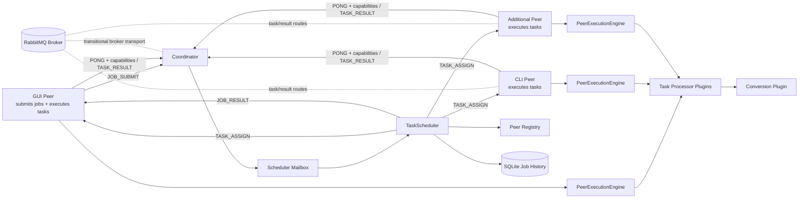

# TaskFlow

[](https://github.com/HuuPhu-Nguyen/Task-Flow-2/actions/workflows/ci.yml)

TaskFlow is a Java 21 coordinated peer-to-peer task execution platform with pluggable job processors, TCP and RabbitMQ transport paths, retry-aware scheduling, persisted job history, and documented execution guarantees.

The project is designed to demonstrate production-relevant distributed systems work: task orchestration, peer scheduling, retries, timeout handling, duplicate-result rejection, broker transport design, and plugin-based extensibility.

---

## Overview

TaskFlow follows a **coordinated peer-to-peer model**:

- A **Coordinator Server** manages job state, task assignment, retries, and result aggregation.
- **Peer nodes** can submit jobs, advertise supported task types, and execute tasks assigned by the coordinator.
- The **TCP JavaFX peer** acts as both a job submitter and a task executor.
- Command-line peers can be started to add more compute capacity.

Jobs are submitted dynamically by peers and processed in a fully asynchronous, message-driven pipeline.

---

## Why This Project Is Interesting

- Modular Maven reactor with explicit SPI, core, transport, coordinator, command-line peer runtime, role-split plugin artifacts, and a JavaFX GUI wired through GUI-facing adapters.
- `ServiceLoader` plugin architecture for adding new job types without changing scheduler core.
- Mailbox-driven scheduler that decouples network I/O from task orchestration.
- Assignment ownership checks that reject duplicate or stale task results.
- Retry and timeout handling with terminal job failure semantics.
- TCP runtime for simple demos and a RabbitMQ adapter path for broker-backed execution.
- SQLite-backed job history for local observability.

---

## Architecture



TCP is the default runtime. TCP peer handlers feed scheduler-bound messages through the bounded scheduler mailbox and wait for capacity when it is full, applying socket-level backpressure instead of dropping accepted peer messages. RabbitMQ support exists as a broker-backed peer runtime: command-line peers register with peer IDs, send heartbeats, receive peer-specific task assignments, publish task results, and can submit jobs through the broker. RabbitMQ mode has opt-in live broker coverage for transport delivery and coordinator job completion, plus bounded scheduler-ingress backpressure for broker deliveries, but remains transitional until broader broker failure paths, durable outbox/replay, and GUI support are complete. See `docs/RABBITMQ_SCOPE.md` for the RabbitMQ support decision and promotion gates.

---

## Framework Modules

TaskFlow is now organized as a Maven reactor:

- `taskflow-spi` - protocol messages, job abstractions, and coordinator, peer, and client plugin contracts
- `taskflow-core` - scheduler, task state, persistence, messaging, peer registry, shared peer execution engine, and metrics
- `plugins/conversion/model` - conversion-owned shared payload/type metadata
- `plugins/conversion/server` - coordinator-side image/video job plugins
- `plugins/conversion/client` - image/video client payload creation and result saving plugins
- `plugins/conversion/peer` - image/video peer processors and media dependencies
- `plugins/text/model` - text-analysis shared payload/result/type metadata
- `plugins/text/server` - coordinator-side text-analysis job plugin
- `plugins/text/client` - text-analysis client payload creation and CSV result saving plugin
- `plugins/text/peer` - text-analysis peer processor
- `taskflow-persistence-sqlite` - SQLite `JobStateStore` implementation and local history query adapter
- `taskflow-transport-rabbitmq` - RabbitMQ broker transport primitives
- `taskflow-coordinator` - coordinator runtime for TCP or RabbitMQ
- `taskflow-peer` - command-line peer runtime for TCP or RabbitMQ, with submitter/executor/combined runtime profiles
- `taskflow-gui` - TCP-only JavaFX peer with GUI-facing adapters and submitter/executor/combined runtime profiles

Framework core no longer imports concrete image, video, or text job classes. New task types should be added under `plugins/<domain>` with separate model, server, client, and peer artifacts when a role needs different dependencies. Server-side scheduling uses `server.job.TaskPlugin`, peer execution uses `peer.engine.PeerProcessorPlugin`, and client upload/result handling uses `client.ClientJobPlugin`. Providers are registered under `META-INF/services`. Server plugins validate submitted parameters and payload shapes during job startup, so malformed submissions fail with a terminal `JOB_RESULT` before tasks are persisted or assigned. See `docs/PLUGIN_AUTHORING.md` for the contributor checklist and role-by-role plugin contract.

The JavaFX presentation layer talks to GUI-facing services for TCP connection lifecycle, job submission, result routing, worker execution, and history reads. The GUI module depends on `taskflow-core` for shared messaging/execution and `taskflow-persistence-sqlite` for local SQLite-backed history reads, but it does not depend on the command-line `taskflow-peer` runtime.

`taskflow-peer` and `taskflow-gui` define Maven runtime profiles so role classpaths can be narrowed without changing source modules:

- `combined-runtime` is active by default and preserves the current combined peer behavior with client plugins and peer processors.
- `submitter-runtime` includes client plugins only. It omits peer processor artifacts and their native media dependencies, including the conversion peer's JavaCV/FFmpeg runtime.
- `executor-runtime` includes peer processors only. Use it for workers that should execute assigned tasks without carrying client payload creation and result-saving plugins.

The coordinator runtime carries server plugin artifacts only. It does not need client plugins or peer processor artifacts.

The core peer registry uses a `transport.TransportConnection` abstraction instead of socket APIs. TCP remains the default runtime, and RabbitMQ can be selected through `TASKFLOW_TRANSPORT=rabbitmq`.

Scheduler persistence goes through `server.db.JobStateStore`; the current implementation is the SQLite-backed `DatabaseManager` in `taskflow-persistence-sqlite`. Initial job and task persistence is transactional: if a configured state store cannot persist a new job at startup, the scheduler rejects that submission with a failed `JOB_RESULT` instead of dispatching untracked work. After startup, assignment persistence must succeed before a task is dispatched, and failed retry, task-failure, or task-completion writes fail the job with a terminal `JOB_RESULT` rather than allowing in-memory state to diverge silently. Final job-status writes happen after final result routing; if that terminal write fails, the scheduler removes the job from active memory and logs `job_terminal_persistence_degraded` so the delivered result and degraded history are inspectable. The SQLite schema is versioned, validates the runtime-supported schema version at startup, enforces `tasks.job_id` references to existing `jobs.job_id` rows, and stores task payload/result snapshots for schema-v2 restart recovery, requester token hashes for result ownership, and requester public keys for signed ownership when present. On startup, resumable `RUNNING` jobs are rebuilt, previously assigned tasks are returned to pending because leases are not implemented, completed tasks with persisted result payloads are restored, and non-resumable legacy running jobs are marked failed. Requesters can send `JOB_RESULT_REQUEST` with the job id and matching requester token; identity-bound jobs must also include the matching requester public key and a valid signature. The coordinator resends an in-memory pending terminal result or reconstructs a completed persisted result when ownership checks pass and every task result snapshot is present. Scheduler ingress is bounded by `inboundQueueCapacity` / `TASKFLOW_SCHEDULER_INBOUND_QUEUE_CAPACITY`; TCP peer handlers wait for mailbox capacity and broker deliveries are requeued when the scheduler mailbox is full and acknowledged only after scheduler handling succeeds.

The RabbitMQ module provides broker topology declaration, JSON protocol serialization, publish/subscribe operations, publisher confirms, peer-specific task/result routing, manual acknowledgement, requeue, reject, dead-letter exchange/queue configuration, and mandatory-return detection for unroutable peer-targeted publishes. Coordinator-side broker deliveries for job submissions and task results are acknowledged after scheduler processing, rather than immediately after broker receipt. RabbitMQ is wired into coordinator and command-line peer entry points, including a basic broker-aware peer submit path.

---

## Core Components

### Coordinator Server

The coordinator is the central entry point of the system.

- Listens for peer connections on port `6789`
- Maintains a registry of connected peers
- Handles networking via `PeerHandler`
- Delegates all scheduling logic to a dedicated `TaskScheduler` thread

The system uses a mailbox-based design where incoming messages are queued and processed asynchronously.

---

### Task Scheduler

The `TaskScheduler` is the core of the system.

**Responsibilities:**
- Handles incoming messages (`JOB_SUBMIT`, `TASK_RESULT`)
- Creates jobs and splits them into tasks
- Dispatches tasks to available peers
- Tracks task progress and retries failed work
- Aggregates results and returns them to the requester

**Load Balancing**
- Default maximum of **3 concurrent tasks per peer**, configurable with `TASKFLOW_MAX_TASKS_PER_PEER`
- Peers are filtered by advertised task capability before assignment
- Eligible peers are selected by a configurable weighted score using load, latency, average task duration, and failure rate

**Failure Handling**
- Default task timeout: **60 seconds**, configurable with `TASKFLOW_TASK_TIMEOUT_MS`
- Automatic retries on failure, configurable with `TASKFLOW_MAX_TASK_RETRIES`
- Failed tasks are returned to the pending queue and retried by available peers
- Final `JOB_RESULT` delivery retries are bounded by `TASKFLOW_JOB_RESULT_MAX_DELIVERY_ATTEMPTS`; exhausted delivery is logged and persisted as a failed job so completed work does not remain active forever

---

### Peer Node

A `PeerNode` connects to the coordinator and executes assigned tasks.

**Responsibilities:**
- Maintain TCP connection with the server
- Respond to heartbeat messages (`PING` / `PONG`)
- Advertise supported task types through heartbeat metadata
- Receive `TASK_ASSIGN` messages
- Execute tasks using the execution engine
- Send results back via `TASK_RESULT`

---

### Execution Engine

Each peer runs a `PeerExecutionEngine`.

- Uses a thread pool sized to available CPU cores
- Executes tasks asynchronously
- Supports pluggable processors for different task types

New task types can be added without modifying the core system.

---

### Job Model

TaskFlow uses a generic abstraction for distributed jobs.

#### EmbarrassinglyParallelJob
- Splits work into independent tasks
- Tracks completion safely (idempotent updates)
- Aggregates final results

#### TaskUnit
Each task tracks:
- Status (`PENDING`, `ASSIGNED`, `COMPLETED`, `FAILED`)
- Assigned peer
- Retry count
- Execution timing

---

## Supported Jobs

Currently implemented job types:

- `IMAGE_CONVERSION`
- `VIDEO_TRANSCODING`
- `TEXT_ANALYSIS`

**Image conversion features:**
- Converts between PNG, JPG, BMP, GIF
- Supports PDF to image conversion
- Uses Apache PDFBox for PDF rendering
- Uses the conversion client plugin to encode local files as Base64 payloads and save decoded results

**Video transcoding features:**
- Converts between MP4, AVI, MKV, MOV, WEBM, FLV, WMV
- Uses JavaCV with bundled FFmpeg native libraries
- Uses broadly available FFmpeg encoders for portability across machines
- Preserves source audio streams when supported by the target format
- Uses the conversion client plugin to encode local files as Base64 payloads and save decoded results

**Text analysis features:**
- Reads TXT, Markdown, CSV, and log files as UTF-8 text
- Uses custom `TextAnalysisPayload` and `TextAnalysisResult` models instead of the conversion plugin's `FilePayload`
- Counts lines, words, characters, and unique words per document
- Saves aggregated CSV results through the text client plugin

Each input is processed independently, allowing full parallel execution across peers.

---

## Message Protocol

TCP communication is done using JSON messages over sockets. RabbitMQ communication uses the same protocol messages wrapped in broker envelopes.

### Message Types

- `JOB_SUBMIT` - submit a new job
- `TASK_ASSIGN` - assign a task to a peer
- `TASK_RESULT` - return result from peer
- `JOB_RESULT` - final aggregated result
- `JOB_RESULT_REQUEST` - request resend or persisted reconstruction of an owned job result using the requester token, plus a requester identity signature for identity-bound jobs
- `PING` - heartbeat from server
- `PONG` - heartbeat response from peer, including supported task types

---

## Workflow

1. GUI uploads files and encodes them in Base64
2. A `JOB_SUBMIT` message is sent to the coordinator
3. The scheduler creates a job and splits it into tasks
4. Tasks are distributed to peers (`TASK_ASSIGN`)
5. Peers execute tasks and return results (`TASK_RESULT`)
6. The scheduler aggregates results
7. The coordinator sends a `JOB_RESULT` back to the submitting peer
8. The GUI allows the user to save output files

---

## GUI Peer

The JavaFX GUI (`PeerApp`) uses the `combined-runtime` profile by default and acts as both:

- a **job-submitting peer**
- a **task-executing peer**

**Features:**
- Upload files
- Select output format
- Submit distributed jobs
- Receive and save results
- Uses temporary session folders for input/output
- JavaFX is TCP-only today: it connects to the TCP coordinator and does not submit jobs, receive job results, or execute assigned work over RabbitMQ
- Can be launched with `-Psubmitter-runtime` or `-Pexecutor-runtime` when a narrower GUI classpath is needed
- Persists per-job requester tokens and a requester identity keypair for TCP submissions under the local user profile so result requests can survive GUI restarts

Requester tokens and the GUI requester identity private key are stored by default at `<user-home>/.taskflow/gui-requester-tokens.properties`. Override the location with `TASKFLOW_GUI_REQUESTER_TOKEN_STORE` when a different local path is needed. On POSIX-compatible filesystems, TaskFlow attempts to restrict that file to owner read/write and its parent directory to owner read/write/execute; on Windows or unsupported filesystems, protection relies on the normal user-profile and filesystem access controls. This is per-job result ownership using bearer tokens and a local signing key, not user account credentials, login sessions, authorization roles, or a credential vault.

---

## Key Design Features

### Asynchronous Message-Driven System
- Decoupled components via message passing
- No blocking request-response model

### Failure Handling
- Task retries
- Timeout detection
- Peer failure handling through heartbeat/liveness checks and scheduler retries

### Load Balancing
- Dynamic scheduling
- Capability-aware peer filtering
- Peer scoring and task limits

### Extensibility
- New job types via `TaskPlugin` and Java `ServiceLoader`
- New peer-side processors via `PeerProcessorPlugin` and `TaskProcessor`
- New client payload/result handlers via `ClientJobPlugin`
- New plugin bundles should live under `plugins/<domain>` and keep coordinator, client, peer, and shared model dependencies separated

---

## Execution Guarantees

TaskFlow currently provides:

- At-least-once task execution semantics
- Timeout + retry handling with terminal task failure after max retries
- Duplicate/stale result rejection based on assignment ownership
- Explicit job failure when any task reaches terminal failed state

Detailed guarantee definitions are documented in:
`docs/EXECUTION_GUARANTEES.md`

---

## Dependencies

- Gson - JSON serialization
- Apache PDFBox - PDF rendering
- JavaFX - GUI
- JavaCV / FFmpeg - video transcoding
- RabbitMQ Java Client - broker transport adapter

---

## Scheduler Configuration

Scheduler retry and peer-selection behavior is externally configurable. Code defaults are only safe fallbacks.

Configuration precedence:

1. Built-in defaults
2. YAML file, default path `config/taskflow.yml`
3. Environment variables

Use [config/taskflow.example.yml](config/taskflow.example.yml) as the committed template, then copy it to `config/taskflow.yml` for local runtime tuning. The local `config/taskflow.yml` file is ignored by Git. Set `TASKFLOW_CONFIG` to use a different YAML path.

```yaml
scheduler:
  taskTimeoutMs: 60000
  maxTasksPerPeer: 3
  maxTaskRetries: 20
  inboundQueueCapacity: 1000
  jobResultMaxDeliveryAttempts: 300
  metricsLogIntervalMs: 10000
  scoring:
    loadWeight: 6.0
    latencyWeight: 2.0
    durationWeight: 1.5
    failureWeight: 4.0
    latencyBaselineMs: 200.0
    durationBaselineMs: 5000.0
    ewmaAlpha: 0.2
```

Environment overrides:

- `TASKFLOW_CONFIG` - optional YAML config path, default `config/taskflow.yml` when present
- `TASKFLOW_TASK_TIMEOUT_MS`
- `TASKFLOW_MAX_TASKS_PER_PEER`
- `TASKFLOW_MAX_TASK_RETRIES`
- `TASKFLOW_SCHEDULER_INBOUND_QUEUE_CAPACITY`
- `TASKFLOW_JOB_RESULT_MAX_DELIVERY_ATTEMPTS`
- `TASKFLOW_METRICS_LOG_INTERVAL_MS`
- `TASKFLOW_SCORE_LOAD_WEIGHT`
- `TASKFLOW_SCORE_LATENCY_WEIGHT`
- `TASKFLOW_SCORE_DURATION_WEIGHT`
- `TASKFLOW_SCORE_FAILURE_WEIGHT`
- `TASKFLOW_SCORE_LATENCY_BASELINE_MS`
- `TASKFLOW_SCORE_DURATION_BASELINE_MS`
- `TASKFLOW_SCORE_EWMA_ALPHA`
- `TASKFLOW_MAX_INPUT_BYTES` - maximum per-file client payload input size for conversion/text plugins, default `33554432` bytes
- `TASKFLOW_MAX_TASKS_PER_JOB` - maximum input files/tasks per submitted client job, default `256`
- `TASKFLOW_MAX_JOB_PAYLOAD_BYTES` - maximum total inline client payload data per job, default `67108864` bytes
- `TASKFLOW_MAX_RESULT_BYTES` - maximum single conversion result payload size before saving/sending, default `67108864` bytes

PowerShell override example:

```powershell
$env:TASKFLOW_CONFIG = "config\taskflow.yml"
$env:TASKFLOW_TASK_TIMEOUT_MS = "120000"
$env:TASKFLOW_MAX_TASKS_PER_PEER = "5"
$env:TASKFLOW_MAX_TASK_RETRIES = "8"
$env:TASKFLOW_SCHEDULER_INBOUND_QUEUE_CAPACITY = "2000"
$env:TASKFLOW_JOB_RESULT_MAX_DELIVERY_ATTEMPTS = "120"
.\mvnw.cmd -pl taskflow-coordinator exec:java
```

---

## RabbitMQ Transport

TCP is the default transport. Set `TASKFLOW_TRANSPORT=rabbitmq` to run the coordinator or command-line peer against RabbitMQ.

The RabbitMQ transport module uses the following routes:

- `jobs.submit` -> `taskflow.jobs`
- `tasks.assign` -> `taskflow.tasks`
- `tasks.result` -> `taskflow.task-results`
- `jobs.result` -> `taskflow.job-results`
- `heartbeats` -> `taskflow.heartbeats`

RabbitMQ peers also declare peer-specific queues for direct assignment/result routing:

- `tasks.assign.<peerId>` -> `taskflow.peer.<peerId>.task-assign`
- `jobs.result.<peerId>` -> `taskflow.peer.<peerId>.job-result`

Configuration can be supplied through environment variables:

- `TASKFLOW_RABBITMQ_HOST`
- `TASKFLOW_RABBITMQ_PORT`
- `TASKFLOW_RABBITMQ_USERNAME`
- `TASKFLOW_RABBITMQ_PASSWORD`
- `TASKFLOW_RABBITMQ_VHOST`
- `TASKFLOW_RABBITMQ_EXCHANGE`
- `TASKFLOW_RABBITMQ_QUEUE_PREFIX`
- `TASKFLOW_RABBITMQ_DURABLE`
- `TASKFLOW_RABBITMQ_PREFETCH`
- `TASKFLOW_RABBITMQ_PUBLISH_CONFIRM_TIMEOUT_MS`
- `TASKFLOW_RABBITMQ_DEAD_LETTER_ENABLED`
- `TASKFLOW_RABBITMQ_DEAD_LETTER_EXCHANGE`
- `TASKFLOW_RABBITMQ_DEAD_LETTER_QUEUE`
- `TASKFLOW_RABBITMQ_DEAD_LETTER_ROUTING_KEY`
- `TASKFLOW_RABBITMQ_REQUEUE_ON_HANDLER_FAILURE`
- `TASKFLOW_PEER_ID`

Default local configuration is `localhost:5672`, user `guest`, password `guest`, vhost `/`, exchange `taskflow.exchange`, queue prefix `taskflow`, durable shared queues enabled, prefetch `3`, publisher confirm timeout `5000` ms, dead-lettering enabled with exchange `taskflow.dead-letter.exchange`, queue `taskflow.dead-letter`, routing key `dead-letter`, and handler failures requeued by default. Malformed broker deliveries are rejected so RabbitMQ can dead-letter them when dead-lettering is enabled. Set `TASKFLOW_RABBITMQ_REQUEUE_ON_HANDLER_FAILURE=false` to reject handler failures instead of requeueing them. TaskFlow declares and uses dead-letter routing, but it does not yet include a TaskFlow DLQ inspection/redrive command or workflow. If `TASKFLOW_PEER_ID` is not set, RabbitMQ command-line peers generate a unique runtime peer ID.

Run the RabbitMQ coordinator on Windows PowerShell:

```powershell
$env:TASKFLOW_TRANSPORT = "rabbitmq"
.\mvnw.cmd -pl taskflow-coordinator exec:java
```

Run a RabbitMQ command-line peer on Windows PowerShell:

```powershell
$env:TASKFLOW_TRANSPORT = "rabbitmq"
$env:TASKFLOW_PEER_ID = "peer-a"
.\mvnw.cmd -pl taskflow-peer exec:java
```

Submit a RabbitMQ job from a command-line peer on Windows PowerShell:

```powershell
$env:TASKFLOW_TRANSPORT = "rabbitmq"
$env:TASKFLOW_PEER_ID = "peer-submit"
.\mvnw.cmd -pl taskflow-peer exec:java "-Dexec.args=submit image png path\to\input.jpg"
```

Use `-Psubmitter-runtime` for a command-line submitter that should not carry peer processor artifacts:

```powershell
$env:TASKFLOW_TRANSPORT = "rabbitmq"
$env:TASKFLOW_PEER_ID = "peer-submit"
.\mvnw.cmd -pl taskflow-peer -Psubmitter-runtime exec:java "-Dexec.args=submit image png path\to\input.jpg"
```

Text analysis uses the same plugin-driven submit path:

```powershell
$env:TASKFLOW_TRANSPORT = "rabbitmq"
$env:TASKFLOW_PEER_ID = "peer-submit"
.\mvnw.cmd -pl taskflow-peer exec:java "-Dexec.args=submit text csv path\to\notes.txt"
```

With the default `combined-runtime` profile, the submitting peer stays available for task execution while waiting for `JOB_RESULT`. Successful CLI-submitted results are written under `target\rabbitmq-results\<jobId>`.

RabbitMQ command-line peers execute assignments asynchronously relative to broker delivery callbacks. Assignment acknowledgements are deferred until the peer publishes the corresponding `TASK_RESULT`. For CLI-submitted jobs, `JOB_RESULT` acknowledgement is deferred until the result has been handled locally. RabbitMQ publishes wait for broker publisher confirms before returning success. Peer-targeted coordinator publishes also use mandatory-return detection, so unroutable task assignments are retried by the scheduler and unroutable job results are not finalized as delivered. If the coordinator scheduler mailbox is full, RabbitMQ job submissions and task results are requeued instead of accepted into process memory.

### Live RabbitMQ Integration Tests

RabbitMQ live broker tests are opt-in and skipped by default so normal builds do not require RabbitMQ.

Start a local broker first, or point the usual `TASKFLOW_RABBITMQ_*` variables at an existing broker. Then run:

```powershell
.\mvnw.cmd -pl taskflow-transport-rabbitmq -am "-Dtaskflow.rabbitmq.live=true" "-Dtest=RabbitMqTransportLiveTest" "-Dsurefire.failIfNoSpecifiedTests=false" test
.\mvnw.cmd -pl taskflow-coordinator -am "-Dtaskflow.rabbitmq.live=true" "-Dtest=RabbitMqCoordinatorLiveIntegrationTest" "-Dsurefire.failIfNoSpecifiedTests=false" test
```

Alternatively, set `TASKFLOW_RABBITMQ_LIVE_TEST=true` before running the same tests.

The transport live tests create unique non-durable exchanges and queues, validate shared-route delivery, validate peer-specific delivery, verify shared-route acknowledgement drains the queue, verify handler-failure requeue behavior, verify reject-to-dead-letter behavior, verify `prefetch=1` limits unacknowledged deliveries, verify client recovery after a broker-side connection close, and clean up their broker resources.

The connection-recovery live test uses the RabbitMQ management API to close the test transport connection from the broker side. It defaults to `http://<TASKFLOW_RABBITMQ_HOST>:15672` with the same RabbitMQ username and password. Override it with `TASKFLOW_RABBITMQ_MANAGEMENT_URL`, `TASKFLOW_RABBITMQ_MANAGEMENT_USERNAME`, and `TASKFLOW_RABBITMQ_MANAGEMENT_PASSWORD` when your broker exposes management elsewhere. If the management API is unavailable, that recovery test is skipped while the other live tests can still run.

The coordinator live test submits a test job through the broker, heartbeat-registers a capable peer, verifies peer-specific task assignment, publishes a peer task result, receives a peer-specific `JOB_RESULT`, and verifies the shared job/result queues drain.

---

## Quick RabbitMQ Demo

The recommended broker-backed demo path is Docker Compose. It runs RabbitMQ, one coordinator, two worker peers, and a one-shot submitting peer that generates twelve tiny image tasks. The submitting peer also stays available for task execution while it waits for the final `JOB_RESULT`.

Build the local demo image first:

```bash
docker compose --progress plain build
```

Run the default two-worker demo:

```bash
docker compose up --no-build --abort-on-container-exit --exit-code-from submitter
```

Expected success indicators:

- `submitter-1 exited with code 0`
- coordinator log contains `event=job_completed ... success=true result_count=12`
- `target/demo-results` contains 12 converted output files

Converted outputs are written to `target/demo-results`, and RabbitMQ job output is retained under `target/rabbitmq-results`. Clean up the demo services with:

```bash
docker compose down --remove-orphans
```

RabbitMQ management is available during the run at `http://localhost:15672` with `guest` / `guest`.

Run the larger three-worker profile with the same built image:

```bash
docker compose --profile full-demo up --no-build --abort-on-container-exit --exit-code-from submitter
docker compose --profile full-demo down --remove-orphans
```

Build and run can be combined with `docker compose up --build`, but the separate build/run sequence above is easier to debug and gives clearer progress during the first dependency build.

On Windows, there is also a PowerShell convenience wrapper for local development:

```powershell
.\scripts\demo-rabbitmq.ps1
```

The script builds the Maven modules with tests skipped, starts RabbitMQ with Docker Compose, waits for the broker and TaskFlow processes to become ready, generates twelve small sample PNG inputs, starts one coordinator and three RabbitMQ peers, submits an image conversion job, and copies the latest converted outputs to `target\demo-results`. Runtime logs are written under `target\demo-logs`.

Useful options:

```powershell
.\scripts\demo-rabbitmq.ps1 -PeerCount 5 -FileCount 15 -TargetFormat jpg
.\scripts\demo-rabbitmq.ps1 -SkipDocker
.\scripts\demo-rabbitmq.ps1 -KeepRabbitMq
```

Requirements:

- Docker Desktop or Docker Engine with Compose
- Enough Docker memory and disk for the Java 21 image plus the JavaCV/FFmpeg-backed conversion plugin

The Docker Compose path does not require Java or Maven on the host machine. The PowerShell wrapper does require host Java because it runs the Maven wrapper and Java processes locally. Use `-KeepRabbitMq` with the PowerShell wrapper if you want the broker to remain available after the script finishes.

---

## Known Limitations

- RabbitMQ live broker tests cover transport delivery, handler-failure requeue/reject/dead-letter behavior, transport-level prefetch backpressure, client recovery after a broker-side connection close, and coordinator end-to-end job completion. Unit coverage verifies bounded scheduler-ingress behavior when the mailbox is full: TCP peer handlers wait for capacity and RabbitMQ broker deliveries are requeued. Full broker outage/restart behavior, adaptive broker/peer throttling, and durable outbox/replay are not complete.
- RabbitMQ mode is functional but transitional; peer-specific routing, publisher confirms, and dead-letter topology configuration are implemented, but there is still no durable outbox/replay model for coordinator crashes around publication and no TaskFlow DLQ review/redrive workflow for rejected messages. `docs/RABBITMQ_SCOPE.md` records the current decision to keep RabbitMQ transitional until outbox/replay and DLQ review/redrive gates are complete.
- The JavaFX GUI is TCP-only: it currently submits jobs, receives results, and executes assigned work through TCP. RabbitMQ submission/execution is command-line only.
- Main Java runtime paths use SLF4J/Logback and the Docker demo emits structured event logs; metrics are currently log-based rather than dashboarded.
- SQLite is the current `JobStateStore` implementation. Its schema is versioned, task rows enforce job referential integrity, initial job persistence failures reject job startup, post-start task-state persistence failures fail jobs terminally, and terminal job-status write failures after result delivery are logged as degraded history. Schema-v2 task payload/result snapshots allow coordinator startup to resume rebuildable `RUNNING` jobs and reconstruct completed persisted job results on request when all task result snapshots exist. Schema-v3 requester token hashes authorize result requests across reconnects, and schema-v4 requester identity keys require signed result requests for identity-bound jobs; assigned tasks are reset to pending on resume because task leases are not implemented, and legacy or otherwise non-resumable running jobs are marked failed. Explicit attempt history, lease-based recovery, and PostgreSQL/Flyway are not implemented; `docs/RECOVERY_SCOPE.md` records the accepted behavior scope and PostgreSQL/Flyway deferral.
- Result ownership uses per-job bearer requester tokens plus signed requester identity when a job was submitted with a requester public key. The coordinator persists only token hashes and public keys, not raw tokens or private keys, and this is not a full user/account authentication model. The JavaFX TCP submitter stores raw requester tokens and its local signing key in a user-profile file so result requests can survive GUI restarts; POSIX owner-only permission hardening is attempted when supported, but this is not a credential vault or role-based authorization system.

---

## Candidate Future Improvements

- Explicit attempt history and lease-based restart recovery before any PostgreSQL/Flyway state-store work
- RabbitMQ durable outbox/replay and DLQ review/redrive workflow
- Additional RabbitMQ failure-path integration tests and JavaFX RabbitMQ submit/execution support
- Distributed coordinator (no single point of failure)
- More task types
- Monitoring and metrics dashboard

---

## Notes

This project is designed to demonstrate practical distributed systems concepts, including:

- task orchestration
- concurrency control
- failure handling
- network-based computation

## How to Run

### Will this run on any computer?

It should run on a normal Windows, macOS, or Linux desktop/laptop if all of these are true:

- Java 21 or newer is installed.
- Maven 3.9 or newer is installed.
- Docker Desktop is installed if you want to run the one-command RabbitMQ demo.
- The machine can download Maven dependencies the first time it builds.
- The GUI machine has a desktop environment available. Headless servers can run the coordinator or command-line peer, but not the JavaFX GUI.
- Port `6789` is open between the coordinator and peer machines.

For multiple computers, start the coordinator on one machine. On every GUI or peer machine, connect to the coordinator machine's IP address instead of `localhost`.

### Prerequisites

Make sure you have the following installed:

- **Java 21 or higher**
- **Maven 3.9+**, or use the included Maven wrapper

Check installation:

```bash
java -version
mvn -version
```

---

### 1. Clone the Repository

```bash
git clone <your-repo-url>
cd TaskFlow
```

---

### 2. Build the Project

```bash
./mvnw clean install
```

On Windows PowerShell, use `.\mvnw.cmd clean install`.

---

### 3. Start the Coordinator Server

In one terminal:

```bash
./mvnw -pl taskflow-coordinator exec:java
```

On Windows PowerShell:

```powershell
.\mvnw.cmd -pl taskflow-coordinator exec:java
```

---

### 4. Start the GUI

In another terminal:

```bash
./mvnw -pl taskflow-gui javafx:run
```

On Windows PowerShell:

```powershell
.\mvnw.cmd -pl taskflow-gui javafx:run
```

---
Inside the GUI:

1. Enter:
   - Host: `localhost` if the coordinator is on the same computer, otherwise the coordinator computer's IP address
   - Port: `6789`
2. Click **Connect**
3. Upload files
4. Choose output format
5. Click **Start Job**
6. Select a folder to save results

For a repeatable desktop smoke checklist covering connection refusal, successful TCP job submit/execute/save, job history refresh, and coordinator disconnect behavior, see [docs/GUI_MANUAL_SMOKE.md](docs/GUI_MANUAL_SMOKE.md).

This JavaFX path is TCP-only. Use the command-line peer for RabbitMQ submission or execution.

---

### Optional: Start a Command-Line Peer

The GUI also executes assigned tasks when run with the default `combined-runtime` profile, so this is optional. Use this when you want another machine or terminal to contribute compute capacity without opening the GUI:

```bash
./mvnw -pl taskflow-peer exec:java -Dexec.args="localhost 6789"
```

Use `-Pexecutor-runtime` for a command-line peer that only needs processor plugins:

```bash
./mvnw -pl taskflow-peer -Pexecutor-runtime exec:java -Dexec.args="localhost 6789"
```

Replace `localhost` with the coordinator machine's IP address when running across computers.

### Notes

- The GUI also acts as a peer and can execute tasks when run with the default `combined-runtime` profile.
- Always start the server before peers or GUI.
- If connection fails, verify port `6789` is available.
- If video conversion fails on one machine but not another, rebuild and restart every coordinator/peer process so all machines use the same compiled code.
