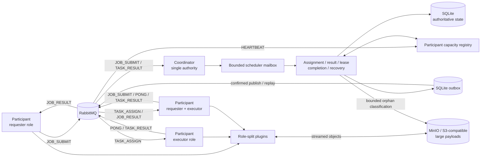

# TaskFlow

[](https://github.com/HuuPhu-Nguyen/Task-Flow-2/actions/workflows/ci.yml)

TaskFlow is a Java 21 coordinator-mediated distributed task-execution framework with dual-role participant nodes. Each participant may submit jobs, execute coordinator-assigned tasks, or do both. The framework demonstrates [at-least-once task execution, generation-fenced authoritative result commitment, lease-based reassignment, durable SQLite recovery, RabbitMQ delivery, transactional outbox publication, and bounded scheduling](docs/reports/correctness-chaos.md), plus [plugin-defined workloads](taskflow-spi/src/test/java/plugin/PluginContractTest.java).

## Guarantees

TaskFlow's supported deployment model is deliberately narrow: one
authoritative coordinator, multiple requester/executor participants, SQLite
state, RabbitMQ transport, and optional MinIO/S3-compatible storage for large
conversion payloads. The normative contract and its I1-I10 evidence ledger are
in [Guarantees and non-goals](docs/GUARANTEES.md).

- **Durable acceptance and recovery.** An accepted job and its task set commit
  atomically; restart rebuilds accepted work from SQLite. The reusable
  [persistence contract](taskflow-core/src/test/java/server/db/PersistenceContractTest.java)
  proves atomic creation, reopen recovery, fencing, monotonic terminal state,
  and outbox replay against the
  [SQLite binding](taskflow-persistence-sqlite/src/test/java/server/db/SqlitePersistenceContractTest.java).
- **At-least-once execution with one authoritative result.** Delivery or
  execution may repeat, but an exact assignment generation can commit only
  once. Duplicate and stale outcomes are typed and do not replace authority;
  this is covered by
  [SQLite conditional-commit tests](taskflow-persistence-sqlite/src/test/java/server/db/DatabaseManagerTest.java),
  [same-participant ABA integration](taskflow-coordinator/src/test/java/server/rabbitmq/AssignmentFencingIntegrationTest.java),
  and the [100,000-task chaos report](docs/reports/correctness-chaos.md).
- **Transactional outbound intent.** Assignment identity, attempt audit, task
  state, and assignment outbox intent commit together. Final job state,
  semantic result, and final-result outbox intent also commit together; crash
  windows are exercised by
  [JobFinalizationCrashTest](taskflow-coordinator/src/test/java/server/JobFinalizationCrashTest.java)
  and the [process crash matrix](taskflow-coordinator/src/test/java/server/CrashWindowMatrixTest.java).
- **Bounded scheduling and admission.** Mailbox lanes, cycle stages, active
  work, payload sizes, pending outbox rows, and executor deduplication caches
  have explicit limits and defined saturation behavior. Boundary behavior is
  covered by
  [SchedulerMailboxTest](taskflow-core/src/test/java/server/scheduler/SchedulerMailboxTest.java),
  [AdmissionPolicyTest](taskflow-core/src/test/java/server/scheduler/AdmissionPolicyTest.java),
  and the [measured overload report](docs/reports/overload.md).
- **Bounded poison handling.** Invalid deliveries reject without ordinary
  requeue; transient and deterministic processing failures use finite delayed
  stages and then quarantine. The live-broker proof is
  [RabbitMqTransportLiveTest](taskflow-transport-rabbitmq/src/test/java/transport/rabbitmq/RabbitMqTransportLiveTest.java).
- **Payload integrity.** Portable object references carry exact length and
  SHA-256 metadata; corrupt bytes are rejected before processing or requester
  output acceptance. The contract is covered by
  [PayloadIntegrityVerifierTest](taskflow-spi/src/test/java/objectstore/PayloadIntegrityVerifierTest.java)
  and the real-MinIO
  [MinioObjectStoreContractTest](taskflow-objectstore-minio/src/test/java/objectstore/minio/MinioObjectStoreContractTest.java).
- **Eventual terminality under stated assumptions.** After failures stop,
  jobs converge to `COMPLETED` or `FAILED` only when the coordinator continues,
  RabbitMQ and SQLite recover, compatible executor capacity returns, plugins
  terminate or time out, and admission/retry policy permits progress. The
  bounded evidence is the
  [generated model suite](taskflow-coordinator/src/test/java/server/TaskFlowModelPropertyTest.java)
  and [correctness-chaos report](docs/reports/correctness-chaos.md).

These guarantees do not make arbitrary plugin side effects exactly once.
Plugin authors must provide purity, idempotence, or a correct external
idempotency key; the retry contract is tested by
[RetrySafetyTest](taskflow-spi/src/test/java/plugin/RetrySafetyTest.java).

## Non-goals

- Multi-coordinator authority, consensus, or zero-downtime coordinator
  failover. SQLite is intentionally the single-writer authority; see
  [ADR-0007](docs/adr/0007-single-authoritative-coordinator.md) and
  [ADR-0008](docs/adr/0008-sqlite-single-writer-state-store.md).
- Exactly-once broker delivery, exactly-once task execution, or automatic
  rollback of external plugin side effects; see
  [ADR-0010](docs/adr/0010-at-least-once-generation-fenced-results.md).
- A general-purpose DAG engine, Kubernetes-style resource scheduler,
  multi-region database, or Byzantine-fault-tolerant system.
- Arbitrarily large RabbitMQ payloads. Conversion data crosses the inline
  threshold through portable object references; see
  [Payload storage](docs/PAYLOAD_STORAGE.md).
- Broad production-readiness, production sizing, or a target RPS. RabbitMQ
  support remains transitional, and measured reports are bounded observations
  on one host; see [Runtime strategy](docs/RUNTIME_STRATEGY.md).

## Architecture



The coordinator alone creates assignments, owns leases and retries, commits
authoritative results, determines terminal jobs, and persists outbound intent.
Participants may have symmetric requester/executor capabilities but never
share scheduling authority. This boundary is enforced by
[RabbitMqOnlyRuntimeArchitectureTest](taskflow-coordinator/src/test/java/server/RabbitMqOnlyRuntimeArchitectureTest.java)
and [SchedulerArchitectureTest](taskflow-core/src/test/java/server/scheduler/SchedulerArchitectureTest.java).

Detailed implementation-matched views trace the component boundary, assignment
outbox, result fence, restart recovery, staged-output lifecycle, and bounded
scheduler/deadline flow to their protected I1-I10 invariants in
[Architecture diagrams tied to invariants](docs/ARCHITECTURE_DIAGRAMS.md).

RabbitMQ is the sole supported runtime transport. `taskflow-peer`, `PeerNode`,
`peerId`, and related names remain compatibility vocabulary for participant
processes and identities; the precise role and identity model is documented in
[Participant identity](docs/PEER_IDENTITY.md).

## Assignment and result protocol

1. A requester plugin builds a versioned `JOB_SUBMIT` with a requester-scoped
   job ID. The coordinator validates ownership, canonical request identity,
   payload bounds, and plugin inputs before atomic job/task creation.
   Exact duplicate and conflicting requests are proved by
   [DuplicateSubmissionIntegrationTest](taskflow-coordinator/src/test/java/server/DuplicateSubmissionIntegrationTest.java).
2. The scheduler selects a compatible executor and proposes an assignment
   UUID. SQLite conditionally advances the attempt generation and atomically
   records `ASSIGNED`, the attempt audit, lease, serialized `TASK_ASSIGN`, and
   pending outbox row. Atomicity and exact replay identity are proved by
   [DatabaseManagerTest](taskflow-persistence-sqlite/src/test/java/server/db/DatabaseManagerTest.java).
3. The outbox publisher sends the stored envelope with persistent delivery,
   publisher confirms, and mandatory-route detection. A failed publish or
   failed sent mark leaves the same row replayable; the reusable evidence is
   [BrokerTransportContractTest](taskflow-spi/src/test/java/transport/BrokerTransportContractTest.java)
   and its
   [RabbitMQ binding](taskflow-transport-rabbitmq/src/test/java/transport/rabbitmq/RabbitMqBrokerContractTest.java).
4. The executor may receive or execute the same assignment more than once.
   Its bounded assignment cache reduces duplicate work but cannot be the
   correctness authority; duplicate-running and duplicate-completed behavior
   is covered by
   [WorkerAssignmentDeduplicationIntegrationTest](taskflow-peer/src/test/java/peer/WorkerAssignmentDeduplicationIntegrationTest.java).
5. `TASK_RESULT` echoes task ID, attempt number, assignment UUID, and executor
   identity. SQLite commits only the current tuple; a late result from
   assignment X cannot replace assignment Y even on the same participant.
   The live-broker ABA proof is
   [RabbitMqCoordinatorLiveIntegrationTest](taskflow-coordinator/src/test/java/server/rabbitmq/RabbitMqCoordinatorLiveIntegrationTest.java).
6. The last successful task result moves the job to durable `FINALIZING`.
   Deterministic aggregation then commits one terminal job result and one
   final-result outbox row before publication. Restart at either boundary is
   covered by
   [JobFinalizationCrashTest](taskflow-coordinator/src/test/java/server/JobFinalizationCrashTest.java).

Protocol versions, compatibility rules, validation limits, and message fields
are defined in [Protocol compatibility](docs/PROTOCOL_COMPATIBILITY.md);
every durable transition is mapped in the
[state machine](docs/STATE_MACHINE.md).

## Failure and recovery

| Failure window | Current behavior | Evidence |
|---|---|---|
| Acceptance reply is lost | An exact authorized resubmission replays the accepted job rather than creating another task set. | [CrashWindowMatrixTest](taskflow-coordinator/src/test/java/server/CrashWindowMatrixTest.java) |
| Assignment commits before publish, or publish succeeds before sent marking | The exact stored assignment envelope remains replayable; generation does not advance again. | [RabbitMqCoordinatorLiveIntegrationTest](taskflow-coordinator/src/test/java/server/rabbitmq/RabbitMqCoordinatorLiveIntegrationTest.java) |
| Executor disappears or a lease expires | The current attempt is durably released/retried, a new generation is assigned, and the old result is fenced. | [Recovery report](docs/reports/recovery.md) |
| Result commits before terminal aggregation | Durable `FINALIZING` and committed task snapshots let restart reconstruct the terminal result. | [JobFinalizationCrashTest](taskflow-coordinator/src/test/java/server/JobFinalizationCrashTest.java) |
| RabbitMQ is unavailable or restarts during work | Startup retry is bounded and interruptible; active single-broker recovery restores topology/consumers and replays pending outbox intent. | [RabbitMqBrokerRecoveryIntegrationTest](taskflow-coordinator/src/test/java/server/rabbitmq/RabbitMqBrokerRecoveryIntegrationTest.java) |
| Coordinator loses an acknowledgement | Redelivery after a prior durable commit is classified as a harmless duplicate, not a second authoritative success. | [RabbitMqCoordinatorLiveIntegrationTest](taskflow-coordinator/src/test/java/server/rabbitmq/RabbitMqCoordinatorLiveIntegrationTest.java) |
| Deterministic poison repeats | Delivery traverses the configured finite delay stages and ends in quarantine with inspection/redrive metadata. | [RabbitMqTransportLiveTest](taskflow-transport-rabbitmq/src/test/java/transport/rabbitmq/RabbitMqTransportLiveTest.java) |
| Attempt output uploads but cannot commit | Upload remains staged; bounded collection deletes stale/orphan attempt objects while preserving active and authoritative keys. | [CrashWindowMatrixTest](taskflow-coordinator/src/test/java/server/CrashWindowMatrixTest.java) |
| Submission pressure reaches configured limits | New work receives a typed pre-acceptance rejection while accepted result/lease work progresses; admission recovers after drain. | [Overload report](docs/reports/overload.md) |

The complete crash-window ledger and its current evidence IDs are in
[Failure model](docs/FAILURE_MODEL.md). Operational liveness/readiness and
degraded-admission semantics are in [Coordinator health](docs/HEALTH.md).

## Quick start

The shortest broker-backed path uses Docker Compose and does not require host
Java or Maven:

```bash
git clone https://github.com/HuuPhu-Nguyen/Task-Flow-2.git
cd Task-Flow-2
docker compose --progress plain build
docker compose up --no-build --abort-on-container-exit --exit-code-from submitter
```

A successful run ends with the submitter exiting successfully, a structured
`job_completed` coordinator event, and converted files under
`target/demo-results`. The underlying event and participant result-path
contracts are covered by
[SchedulerEventLogTest](taskflow-core/src/test/java/server/scheduler/SchedulerEventLogTest.java)
and [PeerNodeTest](taskflow-peer/src/test/java/peer/PeerNodeTest.java).
Inspect RabbitMQ locally at
`http://localhost:15672` with the Compose-only development credentials
`guest` / `guest`.

Clean up the demo services:

```bash
docker compose down --remove-orphans
```

On Windows, the host-process convenience path is:

```powershell
.\scripts\demo-rabbitmq.ps1
```

It requires host Java and Docker. Runtime logs are written under
`target\demo-logs`; use `-KeepRabbitMq` only when the local broker should
remain running.

## One-command stale-result demo

Run the deterministic lease-expiry and same-executor ABA proof without Docker
or RabbitMQ:

```powershell
.\scripts\demo-stale-result-fencing.ps1
```

The command asserts assignment X, exact lease expiry, assignment Y, stale-X
rejection, current-Y commitment, and one terminal result. The expected trace,
durable assertions, and limitations are recorded in
[Stale-result demo](docs/STALE_RESULT_DEMO.md), backed by
[AssignmentFencingIntegrationTest](taskflow-coordinator/src/test/java/server/rabbitmq/AssignmentFencingIntegrationTest.java).

## Benchmark evidence

These are reproducible correctness and performance observations, not service
level objectives or production-sizing guidance.

| Evidence | Fixed workload | Observed result | Report |
|---|---|---|---|
| Correctness under mixed faults | 100,000 lightweight tasks in 400 jobs; deterministic duplicates/delays, executor transport terminations, one broker restart, and one coordinator-component restart | 100,000/100,000 tasks completed; zero non-completed jobs, stale authoritative successes, lost accepted tasks, running attempts, or pending outbox rows | [Correctness chaos](docs/reports/correctness-chaos.md) |
| Scaling | 10,000 measured tasks after warm-up at 1, 2, 4, and 8 separate executor JVMs | 101.603, 123.602, 116.320, and 122.131 tasks/s; eight-executor parallel efficiency 15.026%, exposing a coordinator-side plateau on this host/workload | [Scaling](docs/reports/scaling.md) |
| Recovery | Separate 1,000/10,000/100,000-task SQLite fixtures, live lease reassignment, RabbitMQ restart plus outbox drain, and MinIO orphan cleanup | 100,000-task reconstruction 2,656.545 ms; broker restart plus 100-row drain 34,736.486 ms; 500-row replay 3.821 rows/s on the measured local path | [Recovery](docs/reports/recovery.md) |
| Sustained overload | 1,004 submissions with capacity-1 mailbox/result lanes and a 16-row new-admission outbox threshold | 4 accepted/completed and 1,000 unique typed rejections; backlog drained; fresh admission recovered without restart; final-three retained-heap span 46,048 bytes | [Overload](docs/reports/overload.md) |

Each report records its tested commit, machine/JVM/container profile, exact
command, metric boundaries, raw-evidence checksums, durable audits, and
limitations. Manual report workflows and push/scheduled evidence tiers are
documented in [CI evidence tiers](docs/CI_EVIDENCE_TIERS.md).

## Module map

| Module | Responsibility |
|---|---|
| `taskflow-spi` | Versioned protocol types; job/client/executor plugin SPIs; portable object references; reusable test contracts |
| `taskflow-core` | Infrastructure-free state machine, scheduler services/loop, participant registry, executor engine, ports, and metrics |
| `taskflow-persistence-sqlite` | SQLite `JobStateStore`, migrations, attempt audit, outbox, recovery, local history, and orphan-retry state |
| `taskflow-objectstore-minio` | MinIO/S3-compatible streaming `ObjectStore` adapter; SDK isolated from core/coordinator |
| `taskflow-transport-rabbitmq` | RabbitMQ topology, serialization, confirms, manual settlement, retry/quarantine, DLQ, and recovery primitives |
| `taskflow-coordinator` | Sole-authority coordinator runtime, SQLite recovery, RabbitMQ ingress/outbox replay, health/metrics, and operator status |
| `taskflow-peer` | Command-line participant with requester-only, executor-only, and combined runtime profiles |
| `taskflow-gui` | JavaFX participant with requester/executor roles and GUI-facing service adapters |
| `plugins/example` | Executable authoring template and reusable contract harness |
| `plugins/conversion` | Image/video model, coordinator, requester, and executor artifacts; JavaCV/FFmpeg remains executor-side |
| `plugins/text` | Text-analysis model, coordinator, requester, and executor artifacts |

`peer`, `PeerNode`, and `PeerProcessorPlugin` are retained compatibility names;
architecturally they refer to a participant process or its executor role.
Role-specific artifacts and runtime profiles are described in
[Release packaging](docs/RELEASE_PACKAGING.md).

## Extension and plugin guide

Add workloads under `plugins/<domain>` and split dependencies by role:

- `model` owns shared payload/result/type metadata;
- `server` validates submissions/results and splits/aggregates jobs;
- `client` creates requester payloads and handles terminal results; and
- `peer` is the compatibility artifact name for executor processors.

Providers use Java `ServiceLoader`. New bindings must pass the unchanged
[PluginContractTest](taskflow-spi/src/test/java/plugin/PluginContractTest.java)
for deterministic splitting/aggregation, stable task IDs, validation,
retry/resource agreement, dependency separation, and portable references
where applicable.

The complete checklist, service registration, dependency rules, example
template, and test harness are in
[Plugin authoring](docs/PLUGIN_AUTHORING.md).

## Operational commands

### Build and evidence

Java 21 or newer, Git, and Docker Engine are required for the complete local
gate because the
[MinIO contract](taskflow-objectstore-minio/src/test/java/objectstore/minio/MinioObjectStoreContractTest.java)
and
[RabbitMQ contract](taskflow-transport-rabbitmq/src/test/java/transport/rabbitmq/RabbitMqBrokerContractTest.java)
use Testcontainers:

```powershell
.\mvnw.cmd test
```

Focused push-fast, push-integration, scheduled-chaos, and manual-report
commands are listed in [CI evidence tiers](docs/CI_EVIDENCE_TIERS.md). The
report-grade verifiers are:

```powershell
.\scripts\verify-correctness-chaos.ps1
.\scripts\verify-scaling.ps1
.\scripts\verify-recovery.ps1
.\scripts\verify-overload.ps1
```

### Run local processes

Start the development broker, then the coordinator and one or more
participants:

```powershell
docker compose up -d rabbitmq
.\mvnw.cmd -pl taskflow-coordinator exec:java
$env:TASKFLOW_PEER_ID = "executor-a"
.\mvnw.cmd -pl taskflow-peer -Pexecutor-runtime exec:java
```

Run a requester-capable CLI participant or JavaFX participant:

```powershell
$env:TASKFLOW_PEER_ID = "requester-a"
.\mvnw.cmd -pl taskflow-peer -Psubmitter-runtime exec:java "-Dexec.args=submit image png path\to\input.jpg"
.\mvnw.cmd -pl taskflow-gui javafx:run
```

The default `combined-runtime` profile enables both requester and executor
roles. Text analysis uses
`"-Dexec.args=submit text csv path\to\notes.txt"`. Successful CLI results are
stored under `target\rabbitmq-results\<jobId>`; that result-path contract is
covered by [PeerNodeTest](taskflow-peer/src/test/java/peer/PeerNodeTest.java).

### Configure large-payload storage

The local MinIO profile deliberately has no checked-in credentials:

```powershell
$env:MINIO_ROOT_USER = "<local-access-key>"
$env:MINIO_ROOT_PASSWORD = "<local-secret-key>"
$env:TASKFLOW_MINIO_BUCKET = "taskflow"
docker compose --profile object-store up --detach minio minio-init
$env:TASKFLOW_MINIO_ENDPOINT = "http://localhost:9000"
$env:TASKFLOW_MINIO_ACCESS_KEY = $env:MINIO_ROOT_USER
$env:TASKFLOW_MINIO_SECRET_KEY = $env:MINIO_ROOT_PASSWORD
```

Verify `minio` is healthy and `minio-init` exits successfully before using
object-backed conversion payloads. Lifecycle, restart, bucket, credential, and
data-retention commands are in [Payload storage](docs/PAYLOAD_STORAGE.md).

### Observe and operate

The coordinator exposes local operational endpoints:

```text
http://127.0.0.1:9464/metrics
http://127.0.0.1:9464/health/live
http://127.0.0.1:9464/health/ready
```

After packaging, inspect persisted and broker state with:

```powershell
java -jar taskflow-coordinator\target\taskflow-coordinator-1.0-SNAPSHOT-coordinator-runtime.jar status summary
java -jar taskflow-coordinator\target\taskflow-coordinator-1.0-SNAPSHOT-coordinator-runtime.jar status jobs 20
java -jar taskflow-coordinator\target\taskflow-coordinator-1.0-SNAPSHOT-coordinator-runtime.jar status outbox 20
java -jar taskflow-coordinator\target\taskflow-coordinator-1.0-SNAPSHOT-coordinator-runtime.jar status queues
```

Inspect or act on dead-letter/quarantine entries through the CLI participant:

```powershell
.\mvnw.cmd -pl taskflow-peer exec:java "-Dexec.args=dlq inspect 5"
.\mvnw.cmd -pl taskflow-peer exec:java "-Dexec.args=dlq inspect-quarantine 5"
.\mvnw.cmd -pl taskflow-peer exec:java "-Dexec.args=dlq redrive 1"
.\mvnw.cmd -pl taskflow-peer exec:java "-Dexec.args=dlq redrive-quarantine 1"
```

Event fields and metric semantics are in
[Observability](docs/OBSERVABILITY.md),
[observability scope](docs/OBSERVABILITY_SCOPE.md), and
[health](docs/HEALTH.md). Scheduler/runtime defaults and environment
precedence are in
[config/taskflow.example.yml](config/taskflow.example.yml); RabbitMQ behavior
and security boundaries are in [RabbitMQ scope](docs/RABBITMQ_SCOPE.md).

## Limitations and future work

TaskFlow is not broadly production-ready. Its current evidence supports a
[single authoritative coordinator](taskflow-coordinator/src/test/java/server/RabbitMqOnlyRuntimeArchitectureTest.java)
and
[single RabbitMQ broker recovery](taskflow-coordinator/src/test/java/server/rabbitmq/RabbitMqBrokerRecoveryIntegrationTest.java)
scenarios, not a highly available distributed control plane.

- RabbitMQ peer-specific assignment/result queues are exclusive, auto-delete,
  and non-durable. Participant-side result persistence, clustered broker
  failover, native TLS wiring, and adaptive broker/executor throttling remain
  incomplete; see [RabbitMQ scope](docs/RABBITMQ_SCOPE.md).
- SQLite assumes one coordinator writer. PostgreSQL/Flyway and coordinated
  multi-writer authority are not implemented; see
  [Recovery scope](docs/RECOVERY_SCOPE.md).
- The JavaFX GUI supports live submit/execute/result delivery but has no
  RabbitMQ `JOB_RESULT_REQUEST` route for post-restart result retrieval.
  Automated window driving also remains outside CI; see
  [GUI automation scope](docs/GUI_AUTOMATION_SCOPE.md).
- Requester tokens and signed requester identity protect per-job result
  ownership; they are not user accounts, RBAC, a credential vault, or a
  general authentication system. See
  [Participant lifecycle](docs/PEER_LIFECYCLE.md).
- Attempt-output orphan collection is bounded and retryable, but automatic
  referenced-input retention/deletion remains out of scope. The implemented
  boundary is covered by
  [CrashWindowMatrixTest](taskflow-coordinator/src/test/java/server/CrashWindowMatrixTest.java);
  see
  [Payload storage](docs/PAYLOAD_STORAGE.md).
- The [correctness](docs/reports/correctness-chaos.md),
  [scaling](docs/reports/scaling.md), [recovery](docs/reports/recovery.md), and
  [overload](docs/reports/overload.md) reports are one-host, controlled
  synthetic workloads. They establish reproducibility and expose bottlenecks;
  they do not establish capacity, latency SLOs, multi-host behavior, native
  media/object-store throughput, or production sizing.

Reasonable future work is driven by an actual deployment requirement:
production promotion of the RabbitMQ boundary, participant-side durable result
replay, an external state-store adapter, multi-coordinator consensus, stronger
transport security, operational dashboards/alerts, and additional
role-separated workload plugins.
