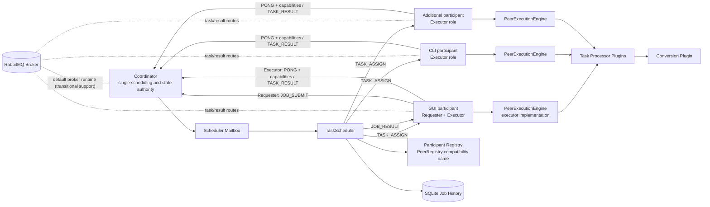

# TaskFlow

[](https://github.com/HuuPhu-Nguyen/Task-Flow-2/actions/workflows/ci.yml)

TaskFlow is a Java 21 coordinator-mediated distributed task-execution framework with dual-role participant nodes. A participant can submit jobs as a requester, execute coordinator-assigned tasks as an executor, or perform both roles. The coordinator remains the sole authority for scheduling, leases, retries, durable state transitions, authoritative result commitment, and job completion.

The project is designed to demonstrate production-relevant distributed systems work: task orchestration, executor scheduling, retries, timeout handling, duplicate-result rejection, broker transport design, and plugin-based extensibility.

---

## Overview

TaskFlow uses a centralized coordination plane with dual-role participant nodes. Participants may have the same requester and executor capabilities, but they do not coordinate authoritative scheduling or result commitment with one another.

| Runtime concept | Responsibility |
|---|---|
| **Coordinator** | Sole authority for durable job state, task assignment, leases, retries, authoritative result commitment, job completion, and persisted outbound intent. |
| **Participant** | A deployable process outside the coordinator that may enable the requester role, executor role, or both. |
| **Requester role** | Submits jobs and receives, queries, or saves results. |
| **Executor role** | Advertises task capabilities and capacity, executes coordinator-assigned tasks, and publishes task results. |

Existing names such as `taskflow-peer`, `PeerNode`, `peerId`, and `nodeId` remain as compatibility names. They identify a participant process; on assignment and result paths, that identity refers to the participant acting in the executor role. The current tracked protocol and schema use `peerId`, `nodeId`, and `assigned_peer_id` rather than a literal `workerId`; no identity field is renamed by this terminology change.

Jobs are submitted dynamically by requester-enabled participants and processed through an asynchronous, coordinator-mediated message pipeline.

---

## Why This Project Is Interesting

- Modular Maven reactor with explicit SPI, core, transport, coordinator, command-line participant runtime, role-split plugin artifacts, and a JavaFX participant UI wired through GUI-facing adapters.
- `ServiceLoader` plugin architecture for adding new job types without changing scheduler core.
- Mailbox-driven scheduler that decouples network I/O from task orchestration.
- SQLite-enforced generation fencing that classifies duplicate and stale task results without changing authoritative state.
- Retry and timeout handling with terminal job failure semantics.
- Default RabbitMQ broker runtime plus a deprecated TCP compatibility/demo path.
- SQLite-backed job history for local observability.

---

## Architecture



RabbitMQ is the default transport for the coordinator, the command-line participant runtime (`taskflow-peer`), and the JavaFX participant runtime when `TASKFLOW_TRANSPORT` is unset or blank. TCP is deprecated as the legacy local compatibility/demo path and must now be selected explicitly with `TASKFLOW_TRANSPORT=tcp`. RabbitMQ remains transitional rather than production-ready: full broker outage/restart behavior and some operational hardening are still open. TCP and RabbitMQ participants use explicit sanitized peer IDs instead of server-side socket-address identity; set `TASKFLOW_PEER_ID` for a stable participant ID across restarts, or let the runtime generate a unique process-scoped fallback for local demos. GUI and command-line requester roles generate peer-scoped job IDs from that compatibility ID, a timestamp, and a full UUID. RabbitMQ participants register with peer IDs, send heartbeats, receive peer-specific task assignments when the executor role is enabled, publish task results, and submit jobs when the requester role is enabled. JavaFX uses the same GUI service boundaries for RabbitMQ submission, task execution, result routing, and result handling, and can still run the legacy TCP path with `TASKFLOW_TRANSPORT=tcp`. RabbitMQ mode has live broker coverage for transport delivery, coordinator job completion, SQLite-backed coordinator outbox replay for seeded pending rows and replayed task-assignment duplicates, and TaskFlow DLQ inspect/redrive/quarantine behavior. Focused failure-path tests cover command-line requester publish exceptions plus JavaFX RabbitMQ heartbeat, task-result publish, and task-execution failure handling. Those broker tests now run in a dedicated GitHub Actions job, while local live runs remain opt-in. Automated JavaFX RabbitMQ desktop smoke evidence is available through `scripts/smoke-rabbitmq-gui.ps1 -AutoRun`. See `docs/adr/README.md` for architecture decision records, `docs/PEER_IDENTITY.md` for the current compatibility identity contract, `docs/PROTOCOL_COMPATIBILITY.md` for protocol version compatibility rules, `docs/RUNTIME_STRATEGY.md` for the runtime decision, `docs/TCP_DEPRECATION_GATES.md` for the current TCP deprecation checklist, `docs/RABBITMQ_SCOPE.md` for the current RabbitMQ support decision, `docs/BACKPRESSURE_SCOPE.md` for the current backpressure boundaries and adaptive-backpressure deferral, and `docs/OBSERVABILITY_SCOPE.md` for the current structured-log event map and metrics-backend deferral.

---

## Framework Modules

TaskFlow is now organized as a Maven reactor:

- `taskflow-spi` - protocol messages, job abstractions, coordinator plugins, requester/client plugins, and executor plugins (the latter retain existing `peer` package names)
- `taskflow-core` - coordinator scheduler and task state, persistence and messaging boundaries, participant registry, shared executor engine, and metrics
- `plugins/example` - executable plugin authoring template and contract harness; it is in the reactor for tests but is not wired into runtime classpaths
- `plugins/conversion/model` - conversion-owned shared payload/type metadata
- `plugins/conversion/server` - coordinator-side image/video job plugins
- `plugins/conversion/client` - image/video client payload creation and result saving plugins
- `plugins/conversion/peer` - image/video executor-role processors and media dependencies; `peer` is the retained artifact name
- `plugins/text/model` - text-analysis shared payload/result/type metadata
- `plugins/text/server` - coordinator-side text-analysis job plugin
- `plugins/text/client` - text-analysis client payload creation and CSV result saving plugin
- `plugins/text/peer` - text-analysis executor-role processor; `peer` is the retained artifact name
- `taskflow-persistence-sqlite` - SQLite `JobStateStore` implementation and local history query adapter
- `taskflow-transport-rabbitmq` - RabbitMQ broker transport primitives
- `taskflow-coordinator` - sole-authority coordinator runtime for TCP or RabbitMQ
- `taskflow-peer` - command-line participant runtime for TCP or RabbitMQ; the compatibility artifact name provides requester-only, executor-only, and combined profiles
- `taskflow-gui` - JavaFX participant runtime for TCP or RabbitMQ with GUI-facing adapters and requester-only, executor-only, and combined profiles

Framework core no longer imports concrete image, video, text, or example job classes. New task types should be added under `plugins/<domain>` with separate model, server, client, and peer artifacts when a role needs different dependencies. Coordinator-side scheduling uses `server.job.TaskPlugin`, executor-role processing uses `peer.engine.PeerProcessorPlugin`, and requester-role upload/final-result handling uses `client.ClientJobPlugin`. Providers are registered under `META-INF/services`. Server plugins validate submitted parameters and payload shapes during job startup, so malformed submissions fail with a terminal `JOB_RESULT` before tasks are persisted or assigned. Conversion plugins can keep binary file bytes inline as Base64 or use local-file payload references when `TASKFLOW_PAYLOAD_STORAGE_DIR` is configured. See `docs/PLUGIN_AUTHORING.md` for the contributor checklist, executable example harness, and role-by-role plugin contract, `docs/PAYLOAD_STORAGE.md` for payload-reference ownership and limits, and `docs/PEER_LIFECYCLE.md` for the participant requester/result-handling lifecycle.

The JavaFX presentation layer talks to GUI-facing services for connection lifecycle, requester-role job submission and result routing, executor-role task execution, and history reads. It is a participant UI, not a separate client architecture. The GUI module depends on `taskflow-core` for shared messaging/execution, `taskflow-persistence-sqlite` for local SQLite-backed history reads, and `taskflow-transport-rabbitmq` for the selectable RabbitMQ adapter, but it does not depend on the command-line `taskflow-peer` runtime.

`taskflow-peer` and `taskflow-gui` define Maven runtime profiles so role classpaths can be narrowed without changing source modules:

- `combined-runtime` is active by default and enables both requester and executor roles with client plugins and peer processor plugins.
- `submitter-runtime` is the existing profile name for a requester-only participant. It includes client plugins and omits peer processor artifacts and their native media dependencies, including the conversion peer artifact's JavaCV/FFmpeg runtime.
- `executor-runtime` enables only the executor role. It includes peer processor plugins for participants that execute assigned tasks without carrying client payload creation and result-saving plugins.

The coordinator runtime carries server plugin artifacts only. It does not need requester/client plugins or executor/peer processor artifacts. Release packages use role-specific artifact names for these profiles; see `docs/RELEASE_PACKAGING.md` for the current coordinator, command-line participant, GUI participant, and plugin bundle package strategy.

The coordinator runtime also exposes operator status commands that read the
SQLite state store and, when requested, RabbitMQ broker state:
`status summary`, `status jobs`, `status peers`, `status outbox`,
`status queues`, and `status dlq`. These commands report persisted jobs,
task retry/lease counts, last-known participants (reported by the compatibility `peers` view), pending coordinator outbox rows,
RabbitMQ queue depths, and DLQ summaries without adding a dashboard or metrics
backend.

The participant registry retains the existing `PeerRegistry` and peer-ID compatibility names and uses a `transport.TransportConnection` abstraction instead of socket APIs. Peer IDs are explicit and sanitized across TCP, RabbitMQ, command-line participants, and JavaFX participants; the TCP coordinator registers participants from their declared peer ID instead of the remote socket address. The runtime registry keeps live connection handles in memory, while the SQLite peer registry store persists durable participant metadata such as peer ID, runtime type, transport, supported task types, heartbeat/disconnect times, status, and scheduling metric snapshots when persistence is available. RabbitMQ is the default transport when `TASKFLOW_TRANSPORT` is unset or blank; TCP is deprecated and can be selected explicitly with `TASKFLOW_TRANSPORT=tcp` for compatibility. See `docs/PEER_IDENTITY.md` for duplicate-ID behavior and generated fallback limits.

Coordinator task/job transition inputs are injectable. `TaskFlowClock` supplies lifecycle/recovery time and scheduler-emitted protocol timestamps, while `AssignmentIdGenerator` supplies each new assignment UUID candidate. Production coordinator entry points share system-clock and random-UUID adapters across startup recovery, the scheduler, and plugin-created task units; focused tests use mutable/fixed clocks and exact UUID sequences, including timeout and lease-expiry scenarios without sleeping for expiry. The SQLite assignment transaction still owns the conditional next attempt number and atomic task/audit/outbox commit. Participant liveness sampling and compatibility peer/job-ID creation remain separate infrastructure concerns. See `docs/EXECUTION_GUARANTEES.md` for the exact boundary and evidence.

Scheduler persistence goes through `server.db.JobStateStore`; the current implementation is the SQLite-backed `DatabaseManager` in `taskflow-persistence-sqlite`. Initial job and task persistence is transactional: if a configured state store cannot persist a new job at startup, the scheduler rejects that submission with a failed `JOB_RESULT` instead of dispatching untracked work. The scheduler also rejects duplicate job IDs that are already active or already present in persisted job history. After startup, assignment persistence must succeed before a task is dispatched, and failed retry or task-failure writes fail the job with a terminal `JOB_RESULT` rather than allowing in-memory state to diverge silently. Successful task results use a typed SQLite transaction that can return `COMMITTED`, duplicate, stale, unknown-task, or storage-failure outcomes. Its conditional task update requires the exact task ID, `ASSIGNED` state, attempt number, assignment ID, and assigned participant; only `COMMITTED` is projected into job memory and executor-success metrics. Duplicate and stale broker deliveries are acknowledged without mutation, while a storage failure leaves the task assigned in memory and is requeued. For RabbitMQ with SQLite persistence, the scheduler supplies an assignment UUID candidate, then SQLite conditionally reads a `PENDING` task, advances its persisted generation, validates that UUID, and commits task state, attempt audit, and the exact serialized `TASK_ASSIGN` outbox envelope in one transaction before the scheduler installs that committed identity in memory and publishes it. Publication retry reuses the stored envelope and cannot create another generation. Terminal job state plus outbound final `JOB_RESULT` is likewise committed through a broker outbox row before immediate publish or replay; non-outbox outputs keep the older final-result-then-terminal-write order, and a failed terminal write after delivery logs `job_terminal_persistence_degraded`. The SQLite schema is versioned, validates the runtime-supported schema version at startup, enforces `tasks.job_id` references to existing `jobs.job_id` rows, and stores task payload/result snapshots for schema-v2 restart recovery, requester token hashes for result ownership, requester public keys for signed ownership when present, schema-v5 peer registry metadata for last-known peer state, schema-v6 final result payloads for completed jobs, schema-v7 task-attempt audit rows for assignment and terminal outcomes, schema-v8 task leases, schema-v9 broker outbox rows for coordinator RabbitMQ publication replay, and schema-v10 current attempt/assignment IDs plus assignment IDs and lease deadlines in the attempt audit. On startup, resumable `RUNNING` jobs are rebuilt, assigned tasks with complete identities and unexpired leases stay assigned, expired or missing leases are released to pending with a `lease_expired` attempt reason, legacy assigned rows without complete identities are released with an inspectable restart reason, completed tasks with persisted result payloads are restored, pending coordinator outbox rows are replayed by RabbitMQ coordinator runs, and non-resumable legacy running jobs are marked failed. Requesters can send `JOB_RESULT_REQUEST` with the job id and matching requester token; identity-bound jobs must also include the matching requester public key and a valid signature. The coordinator resends an in-memory pending terminal result or reconstructs a completed persisted result when ownership checks pass and every task result snapshot is present; when a schema-v6 final payload exists, that semantic payload is returned with the compatibility task-result list. Scheduler ingress is bounded by `inboundQueueCapacity` / `TASKFLOW_SCHEDULER_INBOUND_QUEUE_CAPACITY`; TCP peer handlers wait for mailbox capacity and broker deliveries are requeued when the scheduler mailbox is full and acknowledged only after scheduler handling succeeds.

The RabbitMQ module provides broker topology declaration, JSON protocol serialization, publish/subscribe operations, publisher confirms, peer-specific task/result routing, manual acknowledgement, requeue, reject, dead-letter exchange/queue configuration, DLQ inspection/redrive/quarantine/discard operations, mandatory-return detection for unroutable peer-targeted publishes, and SQLite-backed coordinator outbox replay for outbound task assignments and final job results. Coordinator-side broker deliveries for job submissions and task results are acknowledged after scheduler processing, rather than immediately after broker receipt. RabbitMQ executor roles use a bounded, process-local cache keyed by assignment ID: a duplicate delivery for running work is acknowledged without a second processor invocation, while a completed cached assignment republishes the same task result before acknowledgement. Size/TTL eviction or participant restart permits re-execution, so the cache reduces duplicate work but SQLite assignment-generation fencing remains the correctness authority. RabbitMQ is wired into coordinator and command-line participant entry points, including a broker-aware requester path that builds payloads and handles successful final results through `ClientJobPlugin.handleResult(...)`. The JavaFX GUI also has a RabbitMQ adapter for broker-backed submit, execute, live `JOB_RESULT` routing, and result handling through the same client plugins. RabbitMQ is the default broker runtime, but it is not a fully supported production runtime until the gates in `docs/RUNTIME_STRATEGY.md` and `docs/RABBITMQ_SCOPE.md` are complete.

---

## Core Components

### Coordinator

The coordinator is the system's single scheduling and state authority.

- Owns authoritative job and task state, assignments, leases, retries, result commitment, job completion, and durable outbound intent
- In legacy TCP mode, listens for participant connections on port `6789`
- Maintains a registry of connected participants
- Handles networking via `PeerHandler`
- Delegates all scheduling logic to a dedicated `TaskScheduler` thread

The system uses a mailbox-based design where incoming messages are queued and processed asynchronously.

---

### Task Scheduler

The `TaskScheduler` is the core of the system.

**Responsibilities:**
- Handles incoming messages (`JOB_SUBMIT`, `TASK_RESULT`)
- Creates jobs and splits them into tasks
- Dispatches tasks to available executor-role participants
- Tracks task progress and retries failed work
- Aggregates results and returns them to the requester

**Load Balancing**
- Default maximum of **3 concurrent tasks per executor participant**, configurable with `TASKFLOW_MAX_TASKS_PER_PEER`
- Executor participants are filtered by advertised task capability before assignment
- Eligible executor participants are selected by a configurable weighted score using load, latency, average task duration, and failure rate

**Failure Handling**
- Default task timeout: **60 seconds**, configurable with `TASKFLOW_TASK_TIMEOUT_MS`
- Default task lease: **120 seconds**, configurable with `TASKFLOW_TASK_LEASE_MS`
- Automatic retries on failure, configurable with `TASKFLOW_MAX_TASK_RETRIES`
- Failed tasks are returned to the pending queue and retried by available executor participants
- Non-outbox final `JOB_RESULT` delivery retries are bounded by `TASKFLOW_JOB_RESULT_MAX_DELIVERY_ATTEMPTS`; exhausted delivery is logged and persisted as a failed job so completed work does not remain active forever. RabbitMQ with SQLite uses the coordinator broker outbox for final `JOB_RESULT` replay instead.

---

### Participant Node

A participant node may enable the requester role, executor role, or both. The existing `PeerNode` and `RabbitMqPeerNode` class names are compatibility names for the command-line participant runtime.

**Requester-role responsibilities:**
- Submit jobs through `JOB_SUBMIT`
- Receive and handle terminal `JOB_RESULT` messages

**Executor-role responsibilities:**
- Maintain the selected transport connection with the coordinator
- Respond to heartbeat messages (`PING` / `PONG`)
- Advertise supported task types through heartbeat metadata
- Receive `TASK_ASSIGN` messages
- Execute tasks using the execution engine
- Send results back via `TASK_RESULT`

---

### Execution Engine

Each executor-enabled participant runs a `PeerExecutionEngine`.

- Uses a thread pool sized to available CPU cores
- Executes tasks asynchronously
- Supports pluggable processors for different task types

New task types can be added without modifying the core system.

---

### Job Model

TaskFlow uses a generic abstraction for distributed jobs.

#### EmbarrassinglyParallelJob
- Splits work into independent tasks
- Tracks completion safely (idempotent updates)
- Aggregates final results

#### TaskUnit
Each task tracks:
- Status (`PENDING`, `ASSIGNED`, `COMPLETED`, `FAILED`)
- Assigned executor participant (persisted through existing peer-ID fields)
- Retry count
- Execution timing

---

## Supported Jobs

Currently implemented job types:

- `IMAGE_CONVERSION`
- `VIDEO_TRANSCODING`
- `TEXT_ANALYSIS`

**Image conversion features:**
- Converts between PNG, JPG, BMP, GIF
- Supports PDF to image conversion
- Uses Apache PDFBox for PDF rendering
- Uses the conversion client plugin to encode local files as inline Base64 payloads by default, or local-file payload references when configured, and save decoded results

**Video transcoding features:**
- Converts between MP4, AVI, MKV, MOV, WEBM, FLV, WMV
- Uses JavaCV with bundled FFmpeg native libraries
- Uses broadly available FFmpeg encoders for portability across machines
- Preserves source audio streams when supported by the target format
- Uses the conversion client plugin to encode local files as inline Base64 payloads by default, or local-file payload references when configured, and save decoded results

**Text analysis features:**
- Reads TXT, Markdown, CSV, and log files as UTF-8 text
- Uses custom `TextAnalysisPayload` and `TextAnalysisResult` models instead of the conversion plugin's `FilePayload`
- Counts lines, words, characters, and unique words per document
- Saves aggregated CSV results through the text client plugin

Each input is processed independently, allowing parallel execution across executor-role participants.

---

## Message Protocol

TCP communication is done using JSON messages over sockets. RabbitMQ communication uses the same protocol messages wrapped in broker envelopes. New messages carry `protocolVersion: 2`. Semantically unchanged message types still accept versions `0` and `1`, while `TASK_ASSIGN` and `TASK_RESULT` require version 2 plus a positive assignment attempt and UUID assignment ID; incompatible task messages are rejected without repeated broker requeue. Parsed messages are also validated for required framework fields, safe peer/job/task identifiers, task-type names, configured task-count limits, configured inline job-payload size, and configured result-payload size before runtime dispatch. See `docs/PROTOCOL_COMPATIBILITY.md` for the per-message compatibility matrix and current fencing boundary.

### Message Types

- `JOB_SUBMIT` - submit a new job
- `TASK_ASSIGN` - assign a task to an executor-role participant with attempt number, assignment UUID, and lease deadline
- `TASK_RESULT` - return a result from that executor role while echoing the assignment attempt and UUID
- `JOB_RESULT` - plugin-defined final `resultPayload` plus a compatibility ordered result list
- `JOB_RESULT_REQUEST` - request resend or persisted reconstruction of an owned job result using the requester token, plus a requester identity signature for identity-bound jobs
- `PING` - heartbeat from server
- `PONG` - heartbeat response from a participant, including executor capabilities

---

## Workflow

1. A requester-enabled participant uses a `ClientJobPlugin` to build job payloads from local inputs
2. A `JOB_SUBMIT` message is sent to the coordinator
3. The scheduler creates a job and splits it into tasks
4. The coordinator distributes tasks to capable executor-role participants (`TASK_ASSIGN`)
5. Executor-role participants execute tasks and return results (`TASK_RESULT`)
6. The scheduler aggregates task results into a plugin-defined final result payload
7. The coordinator sends a terminal `JOB_RESULT` back to the requester role of the submitting participant
8. The submitter-side result handler uses the matching `ClientJobPlugin` to handle successful final results

---

## GUI Participant

The JavaFX GUI (`PeerApp`) uses the `combined-runtime` profile by default and acts as both:

- a **requester role** that submits jobs and handles results
- an **executor role** that runs coordinator-assigned tasks

**Features:**
- Upload files
- Select output format
- Submit distributed jobs
- Receive and save results
- Uses temporary session folders for input/output
- Uses RabbitMQ by default and can use legacy TCP when `TASKFLOW_TRANSPORT=tcp` is set before launch
- Can be launched with `-Psubmitter-runtime` or `-Pexecutor-runtime` when a narrower GUI classpath is needed
- Persists per-job requester tokens and a requester identity keypair under the local user profile; TCP result requests can survive GUI restarts, while RabbitMQ GUI currently handles live `JOB_RESULT` delivery and does not send `JOB_RESULT_REQUEST` over the broker

See `docs/PEER_LIFECYCLE.md` for how GUI and command-line participant requester/result paths share client-plugin semantics, and where the legacy TCP command-line participant differs.

Requester tokens and the GUI requester identity private key are stored by default at `<user-home>/.taskflow/gui-requester-tokens.properties`. Override the location with `TASKFLOW_GUI_REQUESTER_TOKEN_STORE` when a different local path is needed. On POSIX-compatible filesystems, TaskFlow attempts to restrict that file to owner read/write and its parent directory to owner read/write/execute; on Windows or unsupported filesystems, protection relies on the normal user-profile and filesystem access controls. This is per-job result ownership using bearer tokens and a local signing key, not user account credentials, login sessions, authorization roles, or a credential vault.

---

## Key Design Features

### Asynchronous Message-Driven System
- Decoupled components via message passing
- No blocking request-response model

### Failure Handling
- Task retries
- Timeout detection
- Executor-participant failure handling through heartbeat/liveness checks and scheduler retries

### Load Balancing
- Dynamic scheduling
- Capability-aware executor filtering
- Executor scoring and task limits

### Extensibility
- New job types via `TaskPlugin` and Java `ServiceLoader`
- New executor-side processors via the existing `PeerProcessorPlugin` and `TaskProcessor` interfaces
- New client payload/final-result handlers via `ClientJobPlugin`
- New plugin bundles should live under `plugins/<domain>` and keep coordinator, requester/client, executor/peer, and shared model dependencies separated

---

## Execution Guarantees

The authoritative contract, non-goals, liveness assumptions, and current-versus-
planned test evidence for invariants I1–I10 are centralized in
[Guarantees and non-goals](docs/GUARANTEES.md). An invariant marked partial or
planned there is not a current runtime guarantee.

The normative crash, duplicate-delivery, outage, overload, and recovery windows
are enumerated in the [failure model](docs/FAILURE_MODEL.md), with current,
partial, and planned test evidence kept explicit.

Detailed baseline implementation behavior is recorded separately in
[Current execution behavior](docs/EXECUTION_GUARANTEES.md).

Every task/job lifecycle mutation, conditional guard, durable/outbox effect,
replay rule, and forbidden edge is mapped in the
[task and job state machine](docs/STATE_MACHINE.md).

The reproducible Phase 0 source, test, throughput, and 10,000-task heap snapshot
is recorded in the [baseline report](docs/reports/baseline.md).

For a repeatable supported fault-injection demo covering TCP peer-disconnect
retry, see [docs/FAULT_INJECTION_DEMO.md](docs/FAULT_INJECTION_DEMO.md).

---

## Dependencies

- Gson - JSON serialization
- Apache PDFBox - PDF rendering
- JavaFX - GUI
- JavaCV / FFmpeg - video transcoding
- RabbitMQ Java Client - broker transport adapter

---

## Scheduler Configuration

Scheduler retry and executor-selection behavior is externally configurable. Existing `*PER_PEER` configuration names remain compatibility names. Code defaults are only safe fallbacks.

Configuration precedence:

1. Built-in defaults
2. YAML file, default path `config/taskflow.yml`
3. Environment variables

Use [config/taskflow.example.yml](config/taskflow.example.yml) as the committed template, then copy it to `config/taskflow.yml` for local runtime tuning. The local `config/taskflow.yml` file is ignored by Git. Set `TASKFLOW_CONFIG` to use a different YAML path.

```yaml
scheduler:
  taskTimeoutMs: 60000
  taskLeaseMs: 120000
  maxTasksPerPeer: 3
  maxTaskRetries: 20
  inboundQueueCapacity: 1000
  jobResultMaxDeliveryAttempts: 300
  metricsLogIntervalMs: 10000
  scoring:
    loadWeight: 6.0
    latencyWeight: 2.0
    durationWeight: 1.5
    failureWeight: 4.0
    latencyBaselineMs: 200.0
    durationBaselineMs: 5000.0
    ewmaAlpha: 0.2
```

Environment overrides:

- `TASKFLOW_CONFIG` - optional YAML config path, default `config/taskflow.yml` when present
- `TASKFLOW_TASK_TIMEOUT_MS`
- `TASKFLOW_TASK_LEASE_MS`
- `TASKFLOW_MAX_TASKS_PER_PEER`
- `TASKFLOW_MAX_TASK_RETRIES`
- `TASKFLOW_SCHEDULER_INBOUND_QUEUE_CAPACITY`
- `TASKFLOW_JOB_RESULT_MAX_DELIVERY_ATTEMPTS`
- `TASKFLOW_METRICS_LOG_INTERVAL_MS`
- `TASKFLOW_SCORE_LOAD_WEIGHT`
- `TASKFLOW_SCORE_LATENCY_WEIGHT`
- `TASKFLOW_SCORE_DURATION_WEIGHT`
- `TASKFLOW_SCORE_FAILURE_WEIGHT`
- `TASKFLOW_SCORE_LATENCY_BASELINE_MS`
- `TASKFLOW_SCORE_DURATION_BASELINE_MS`
- `TASKFLOW_SCORE_EWMA_ALPHA`
- `TASKFLOW_MAX_INPUT_BYTES` - maximum per-file client payload input size for conversion/text plugins, default `33554432` bytes
- `TASKFLOW_MAX_TASKS_PER_JOB` - maximum input files/tasks per submitted client job, default `256`
- `TASKFLOW_MAX_JOB_PAYLOAD_BYTES` - maximum total inline client payload data per job, default `67108864` bytes
- `TASKFLOW_MAX_RESULT_BYTES` - maximum single conversion result payload size before saving/sending, default `67108864` bytes
- `TASKFLOW_PAYLOAD_STORAGE_DIR` - optional local/shared filesystem root for conversion payload references
- `TASKFLOW_EXTERNAL_PAYLOAD_THRESHOLD_BYTES` - raw byte threshold for externalizing conversion inputs/results when a payload storage root is configured, default `8388608` bytes

PowerShell override example:

```powershell
$env:TASKFLOW_CONFIG = "config\taskflow.yml"
$env:TASKFLOW_TASK_TIMEOUT_MS = "120000"
$env:TASKFLOW_MAX_TASKS_PER_PEER = "5"
$env:TASKFLOW_MAX_TASK_RETRIES = "8"
$env:TASKFLOW_SCHEDULER_INBOUND_QUEUE_CAPACITY = "2000"
$env:TASKFLOW_JOB_RESULT_MAX_DELIVERY_ATTEMPTS = "120"
.\mvnw.cmd -pl taskflow-coordinator exec:java
```

---

## RabbitMQ Transport

RabbitMQ is the default transport when `TASKFLOW_TRANSPORT` is unset or blank. TCP is the deprecated legacy transport and is available only as an explicit compatibility mode with `TASKFLOW_TRANSPORT=tcp`.

The RabbitMQ transport module uses the following routes:

- `jobs.submit` -> `taskflow.jobs`
- `tasks.assign` -> `taskflow.tasks`
- `tasks.result` -> `taskflow.task-results`
- `jobs.result` -> `taskflow.job-results`
- `heartbeats` -> `taskflow.heartbeats`

RabbitMQ participant runtimes also declare peer-specific compatibility queues for direct assignment/result routing:

- `tasks.assign.<peerId>` -> `taskflow.peer.<peerId>.task-assign`
- `jobs.result.<peerId>` -> `taskflow.peer.<peerId>.job-result`

Configuration can be supplied through environment variables:

- `TASKFLOW_RABBITMQ_HOST`
- `TASKFLOW_RABBITMQ_PORT`
- `TASKFLOW_RABBITMQ_USERNAME`
- `TASKFLOW_RABBITMQ_PASSWORD`
- `TASKFLOW_RABBITMQ_VHOST`
- `TASKFLOW_RABBITMQ_EXCHANGE`
- `TASKFLOW_RABBITMQ_QUEUE_PREFIX`
- `TASKFLOW_RABBITMQ_DURABLE`
- `TASKFLOW_RABBITMQ_PREFETCH`
- `TASKFLOW_RABBITMQ_PUBLISH_CONFIRM_TIMEOUT_MS`
- `TASKFLOW_RABBITMQ_DEAD_LETTER_ENABLED`
- `TASKFLOW_RABBITMQ_DEAD_LETTER_EXCHANGE`
- `TASKFLOW_RABBITMQ_DEAD_LETTER_QUEUE`
- `TASKFLOW_RABBITMQ_DEAD_LETTER_ROUTING_KEY`
- `TASKFLOW_RABBITMQ_REQUEUE_ON_HANDLER_FAILURE`
- `TASKFLOW_PEER_ID`
- `TASKFLOW_ASSIGNMENT_CACHE_MAX_ENTRIES`
- `TASKFLOW_ASSIGNMENT_CACHE_TTL_MS`

Default local configuration is `localhost:5672`, user `guest`, password `guest`, vhost `/`, exchange `taskflow.exchange`, queue prefix `taskflow`, durable shared queues enabled, prefetch `3`, publisher confirm timeout `5000` ms, dead-lettering enabled with exchange `taskflow.dead-letter.exchange`, queue `taskflow.dead-letter`, quarantine queue `taskflow.dead-letter.quarantine`, routing key `dead-letter`, and handler failures requeued by default. The executor assignment-result cache defaults to `4096` entries and a `900000` ms (15 minute) TTL; both values must be positive. Malformed or validation-failing broker deliveries are rejected so RabbitMQ can dead-letter them when dead-lettering is enabled. Set `TASKFLOW_RABBITMQ_REQUEUE_ON_HANDLER_FAILURE=false` to reject handler failures instead of requeueing them. TaskFlow DLQ commands inspect dead-letter metadata, redrive valid TaskFlow envelopes to their original routing key, quarantine entries, or discard entries. Redrive refuses malformed or non-TaskFlow poison messages and leaves them in the DLQ for quarantine or discard. `TASKFLOW_PEER_ID` is the retained participant-identity setting shared by TCP, RabbitMQ, command-line participants, and JavaFX participants; if it is unset, the runtime generates a safe unique process-scoped peer ID. Generated fallback IDs are not stable across restarts, so set `TASKFLOW_PEER_ID` for stable logs, routes, and peer-scoped job IDs.

For anything beyond the local Docker/demo broker, do not use the default `guest` / `guest` credentials. Create a dedicated RabbitMQ vhost and least-privilege user for TaskFlow, store the password outside source control, restrict the management API, and keep AMQP traffic on a trusted network. TaskFlow does not currently expose native RabbitMQ TLS/certificate configuration; if broker traffic crosses an untrusted network, put it behind a verified TLS-terminating tunnel/proxy or add and test RabbitMQ Java client TLS wiring before making deployment-security claims.

The RabbitMQ examples below set `TASKFLOW_TRANSPORT=rabbitmq` for readability; that line is optional because RabbitMQ is the default.

Run the RabbitMQ coordinator on Windows PowerShell:

```powershell
$env:TASKFLOW_TRANSPORT = "rabbitmq"
.\mvnw.cmd -pl taskflow-coordinator exec:java
```

Run a RabbitMQ command-line participant on Windows PowerShell:

```powershell
$env:TASKFLOW_TRANSPORT = "rabbitmq"
$env:TASKFLOW_PEER_ID = "peer-a"
.\mvnw.cmd -pl taskflow-peer exec:java
```

Submit a RabbitMQ job through the requester role of a command-line participant on Windows PowerShell:

```powershell
$env:TASKFLOW_TRANSPORT = "rabbitmq"
$env:TASKFLOW_PEER_ID = "peer-submit"
.\mvnw.cmd -pl taskflow-peer exec:java "-Dexec.args=submit image png path\to\input.jpg"
```

Use the `-Psubmitter-runtime` compatibility profile for a requester-only command-line participant that should not carry peer processor artifacts:

```powershell
$env:TASKFLOW_TRANSPORT = "rabbitmq"
$env:TASKFLOW_PEER_ID = "peer-submit"
.\mvnw.cmd -pl taskflow-peer -Psubmitter-runtime exec:java "-Dexec.args=submit image png path\to\input.jpg"
```

Text analysis uses the same plugin-driven submit path:

```powershell
$env:TASKFLOW_TRANSPORT = "rabbitmq"
$env:TASKFLOW_PEER_ID = "peer-submit"
.\mvnw.cmd -pl taskflow-peer exec:java "-Dexec.args=submit text csv path\to\notes.txt"
```

With the default `combined-runtime` profile, the submitting participant also keeps its executor role available while waiting for `JOB_RESULT`. Successful CLI-submitted results are handled under `target\rabbitmq-results\<jobId>`.

Inspect or act on the RabbitMQ dead-letter queue through the compatibility `taskflow-peer` artifact:

```powershell
$env:TASKFLOW_TRANSPORT = "rabbitmq"
.\mvnw.cmd -pl taskflow-peer exec:java "-Dexec.args=dlq inspect 5"
.\mvnw.cmd -pl taskflow-peer exec:java "-Dexec.args=dlq redrive 1"
.\mvnw.cmd -pl taskflow-peer exec:java "-Dexec.args=dlq quarantine 1"
.\mvnw.cmd -pl taskflow-peer exec:java "-Dexec.args=dlq discard 1"
```

`inspect` is non-destructive. `redrive` republishes only valid TaskFlow broker envelopes to the original routing key captured by RabbitMQ dead-letter metadata, increments `x-taskflow-redrive-count`, and acknowledges the DLQ entry only after the broker confirms the publish. Malformed or unknown-route entries are not redriven; use `quarantine` or `discard` after review.

Run a RabbitMQ JavaFX participant on Windows PowerShell:

```powershell
$env:TASKFLOW_TRANSPORT = "rabbitmq"
$env:TASKFLOW_PEER_ID = "gui-peer-a"
.\mvnw.cmd -pl taskflow-gui javafx:run
```

The GUI connection screen uses broker host `localhost` and port `5672` by default in RabbitMQ mode. A RabbitMQ GUI participant publishes signed `JOB_SUBMIT` messages in its requester role, sends heartbeats and consumes peer-specific `TASK_ASSIGN` queues in its executor role, consumes its `JOB_RESULT` queue, defers assignment acknowledgement until its `TASK_RESULT` publish is confirmed, and routes successful final results to the existing plugin-backed save window. RabbitMQ GUI `JOB_RESULT_REQUEST` is not implemented because there is no broker route for that request yet; live broker result delivery is the supported GUI RabbitMQ result path.

RabbitMQ executor roles execute assignments asynchronously relative to broker delivery callbacks. Assignment acknowledgements are deferred until the participant publishes the corresponding `TASK_RESULT`. For CLI-submitted jobs, `JOB_RESULT` acknowledgement is deferred until the requester role has handled the result locally; for JavaFX participants, `JOB_RESULT` is acknowledged after the GUI accepts it for routing to the user-facing result flow. RabbitMQ publishes wait for broker publisher confirms before returning success. Peer-targeted compatibility routes also use mandatory-return detection. With SQLite persistence, coordinator-originated task assignments and final job results are written to the broker outbox before publish; unconfirmed or unroutable publishes remain pending for replay instead of being treated as delivered. If the coordinator scheduler mailbox is full, RabbitMQ job submissions and task results are requeued instead of accepted into process memory.

### Live RabbitMQ Integration Tests

RabbitMQ live broker tests are opt-in and skipped by default so normal builds do not require RabbitMQ.

Start a local broker first, or point the usual `TASKFLOW_RABBITMQ_*` variables at an existing broker. Then run:

```powershell
.\mvnw.cmd -pl taskflow-transport-rabbitmq -am "-Dtaskflow.rabbitmq.live=true" "-Dtest=RabbitMqTransportLiveTest" "-Dsurefire.failIfNoSpecifiedTests=false" test
.\mvnw.cmd -pl taskflow-coordinator -am "-Dtaskflow.rabbitmq.live=true" "-Dtest=RabbitMqCoordinatorLiveIntegrationTest" "-Dsurefire.failIfNoSpecifiedTests=false" test
```

Alternatively, set `TASKFLOW_RABBITMQ_LIVE_TEST=true` before running the same tests.

GitHub Actions also runs a dedicated `RabbitMQ Integration Tests` job with a `rabbitmq:3.13-management` service container and this focused selector:

```bash
bash ./mvnw --batch-mode --no-transfer-progress -pl taskflow-transport-rabbitmq,taskflow-coordinator,taskflow-peer,taskflow-gui -am -Dtaskflow.rabbitmq.live=true -Dtest=RabbitMqTransportLiveTest,RabbitMqCoordinatorLiveIntegrationTest,PeerNodeTest,RabbitMqJobSubmissionClientTest,RabbitMqCoordinatorConnectionTest -Dsurefire.failIfNoSpecifiedTests=false test
```

The transport live tests create unique non-durable exchanges and queues, validate shared-route delivery, validate peer-specific delivery, verify shared-route acknowledgement drains the queue, verify handler-failure requeue behavior, verify reject-to-dead-letter behavior, verify DLQ inspect/redrive/quarantine behavior for handler failures and malformed poison messages, verify `prefetch=1` limits unacknowledged deliveries, verify client recovery after a broker-side connection close, and clean up their broker resources.

The connection-recovery live test uses the RabbitMQ management API to close the test transport connection from the broker side. It defaults to `http://<TASKFLOW_RABBITMQ_HOST>:15672` with the same RabbitMQ username and password. Override it with `TASKFLOW_RABBITMQ_MANAGEMENT_URL`, `TASKFLOW_RABBITMQ_MANAGEMENT_USERNAME`, and `TASKFLOW_RABBITMQ_MANAGEMENT_PASSWORD` when your broker exposes management elsewhere. If the management API is unavailable, that recovery test is skipped while the other live tests can still run.

The coordinator live suite covers broker-backed job completion, seeded assignment/final-result outbox replay, duplicate delivery after an uncertain assignment publish, and the complete same-participant ABA sequence. In the ABA scenario, attempt 1 / assignment X is failed, the same participant receives attempt 2 / assignment Y, a late successful X result is acknowledged as stale without changing Y, and only Y produces the authoritative result.

---

## Quick RabbitMQ Demo

The recommended broker-backed demo path is Docker Compose. It runs RabbitMQ, one coordinator, two executor-only participants, and a one-shot requester participant that generates twelve tiny image tasks. The requester uses the combined profile, so the same process also remains available in the executor role while it waits for the final `JOB_RESULT`.

Build the local demo image first:

```bash
docker compose --progress plain build
```

Run the default demo with two executor-only participants:

```bash
docker compose up --no-build --abort-on-container-exit --exit-code-from submitter
```

Expected success indicators:

- `submitter-1 exited with code 0`
- coordinator log contains `event=job_completed ... success=true result_count=12`
- `target/demo-results` contains 12 converted output files

Converted outputs are written to `target/demo-results`, and RabbitMQ job output is retained under `target/rabbitmq-results`. Clean up the demo services with:

```bash
docker compose down --remove-orphans
```

RabbitMQ management is available during the run at `http://localhost:15672` with `guest` / `guest`.

Run the larger profile with three executor-only participants using the same built image:

```bash
docker compose --profile full-demo up --no-build --abort-on-container-exit --exit-code-from submitter
docker compose --profile full-demo down --remove-orphans
```

Build and run can be combined with `docker compose up --build`, but the separate build/run sequence above is easier to debug and gives clearer progress during the first dependency build.

On Windows, there is also a PowerShell convenience wrapper for local development:

```powershell
.\scripts\demo-rabbitmq.ps1
```

The script builds the Maven modules with tests skipped, starts RabbitMQ with Docker Compose, waits for the broker and TaskFlow processes to become ready, generates twelve small sample PNG inputs, starts one coordinator and three RabbitMQ participants, submits an image conversion job, and copies the latest converted outputs to `target\demo-results`. Runtime logs are written under `target\demo-logs`.

Useful options:

```powershell
.\scripts\demo-rabbitmq.ps1 -PeerCount 5 -FileCount 15 -TargetFormat jpg
.\scripts\demo-rabbitmq.ps1 -SkipDocker
.\scripts\demo-rabbitmq.ps1 -KeepRabbitMq
```

Requirements:

- Docker Desktop or Docker Engine with Compose
- Enough Docker memory and disk for the Java 21 image plus the JavaCV/FFmpeg-backed conversion plugin

The Docker Compose path does not require Java or Maven on the host machine. The PowerShell wrapper does require host Java because it runs the Maven wrapper and Java processes locally. Use `-KeepRabbitMq` with the PowerShell wrapper if you want the broker to remain available after the script finishes.

---

## Known Limitations

- RabbitMQ live broker tests cover transport delivery, handler-failure requeue/reject/dead-letter behavior, DLQ inspect/redrive/quarantine behavior, transport-level prefetch backpressure, client recovery after a broker-side connection close, coordinator end-to-end job completion, and coordinator outbox replay for seeded pending rows plus replayed duplicate task assignments. Unit coverage verifies bounded scheduler-ingress behavior when the mailbox is full, centralized protocol validation for malformed/oversize/unsafe messages, coordinator outbox behavior for task-assignment and final-result publication, command-line requester publish exceptions, JavaFX RabbitMQ heartbeat publish failure, JavaFX task-result publish failure, JavaFX task-execution failure requeue, and DLQ decision handling for redrive, quarantine, discard, unroutable redrive, and poison messages. Full broker outage/restart behavior and adaptive broker/executor throttling are not complete; `docs/BACKPRESSURE_SCOPE.md` records the current backpressure boundaries and deferral conditions.
- RabbitMQ is the default runtime, but RabbitMQ mode is still transitional rather than production-ready. Implemented pieces include peer-specific routing, explicit peer IDs, peer-scoped job IDs, persisted peer registry metadata, publisher confirms, coordinator outbox replay with live crash-window coverage, command-line and JavaFX GUI submit/result handling, automated JavaFX RabbitMQ desktop smoke coverage, broker-backed CI for the focused live integration gates, and DLQ inspect/redrive/quarantine/discard commands. Open gaps include full broker outage/restart behavior and support-promotion evidence. `docs/PEER_IDENTITY.md` records the current identity contract; `docs/RUNTIME_STRATEGY.md` records the runtime decision and TCP deprecation/removal gates; `docs/RABBITMQ_SCOPE.md` records the current support limits.
- The JavaFX GUI can use RabbitMQ for live submit, execute, and result delivery, but it does not send RabbitMQ `JOB_RESULT_REQUEST` messages for post-restart result replay.
- Main Java runtime paths use SLF4J/Logback and the Docker demo emits structured event logs; metrics are currently log-based rather than dashboarded. Assignment generations and committed, stale, or duplicate task results have distinct events with the complete job/task/attempt/assignment/executor correlation tuple, plus stable `taskflow_*_total` counter names. `docs/OBSERVABILITY_SCOPE.md` maps the exact events, counters, and metrics-backend deferral.
- SQLite is the current `JobStateStore`, peer registry store, and coordinator broker outbox store implementation. Its schema is versioned, task rows enforce job referential integrity, initial job persistence failures reject job startup, retry/task-failure persistence failures fail jobs terminally, and successful-result storage failures remain retryable without an in-memory completion. Non-outbox terminal job-status write failures after result delivery are logged as degraded history. Schema-v2 task payload/result snapshots allow coordinator startup to resume rebuildable `RUNNING` jobs and reconstruct completed persisted job results on request when all task result snapshots exist. Schema-v3 requester token hashes authorize result requests across reconnects, schema-v4 requester identity keys require signed result requests for identity-bound jobs, schema-v5 peer registry rows retain durable peer metadata across coordinator restart, schema-v6 stores completed final result payloads, schema-v7 stores task-attempt audit rows for assignment and terminal outcomes, schema-v8 stores lease metadata, schema-v9 stores coordinator broker outbox rows, and schema-v10 stores the current attempt/assignment ID on task rows and assignment ID/lease deadline on attempt rows. Startup recovery preserves only complete assignment identities with unexpired leases, releases expired or incomplete legacy assignments to pending without resetting the last known generation, replays pending coordinator outbox rows for RabbitMQ runs, and marks otherwise non-resumable running jobs failed.
- PostgreSQL/Flyway is not implemented; `docs/RECOVERY_SCOPE.md` records the lease behavior and PostgreSQL/Flyway deferral.
- Result ownership uses per-job bearer requester tokens plus signed requester identity when a job was submitted with a requester public key. The coordinator persists only token hashes and public keys, not raw tokens or private keys, and this is not a full user/account authentication model. The JavaFX submitter stores raw requester tokens and its local signing key in a user-profile file; TCP result requests can use those tokens across GUI restarts, while RabbitMQ GUI result-request replay is not implemented. POSIX owner-only permission hardening is attempted when supported, but this is not a credential vault or role-based authorization system.

---

## Candidate Future Improvements

- PostgreSQL/Flyway state-store support if a real external database requirement appears
- RabbitMQ support-promotion evidence after the default flip
- Full RabbitMQ broker outage/restart recovery if the deployment goal requires it
- Distributed coordinator (no single point of failure)
- More task types
- Monitoring and metrics dashboard

---

## Notes

This project is designed to demonstrate practical distributed systems concepts, including:

- task orchestration
- concurrency control
- failure handling
- network-based computation

## How to Run

### Will this run on any computer?

It should run on a normal Windows, macOS, or Linux desktop/laptop if all of these are true:

- Java 21 or newer is installed.
- Maven 3.9 or newer is installed.
- Docker Desktop is installed if you want to run the local RabbitMQ broker or the one-command RabbitMQ demo.
- The machine can download Maven dependencies the first time it builds.
- The GUI machine has a desktop environment available. Headless servers can run the coordinator or command-line participant, but not the JavaFX GUI.
- A RabbitMQ broker is reachable on port `5672` between the coordinator and participant machines.
- If you explicitly run legacy TCP mode with `TASKFLOW_TRANSPORT=tcp`, port `6789` must be open between the coordinator and participant machines.

For multiple computers, run or expose RabbitMQ on one machine. On every coordinator or participant machine, set `TASKFLOW_RABBITMQ_HOST` to the broker machine's IP address or enter that broker host in the GUI instead of `localhost`.

### Prerequisites

Make sure you have the following installed:

- **Java 21 or higher**
- **Maven 3.9+**, or use the included Maven wrapper

Check installation:

```bash
java -version
mvn -version
```

---

### 1. Clone the Repository

```bash
git clone <your-repo-url>
cd TaskFlow
```

---

### 2. Build the Project

```bash
./mvnw clean install
```

On Windows PowerShell, use `.\mvnw.cmd clean install`.

---

### 3. Start RabbitMQ

In one terminal:

```bash
docker compose up -d rabbitmq
```

RabbitMQ management will be available at `http://localhost:15672` with `guest` / `guest` for local development.

### 4. Start the Coordinator Server

In another terminal:

```bash
./mvnw -pl taskflow-coordinator exec:java
```

On Windows PowerShell:

```powershell
.\mvnw.cmd -pl taskflow-coordinator exec:java
```

---

### 5. Start the GUI

In another terminal:

```bash
./mvnw -pl taskflow-gui javafx:run
```

On Windows PowerShell:

```powershell
.\mvnw.cmd -pl taskflow-gui javafx:run
```

---
Inside the GUI:

1. Enter:
   - Host: `localhost` if RabbitMQ is on the same computer, otherwise the broker computer's IP address
   - Port: `5672`
2. Click **Connect**
3. Upload files
4. Choose output format
5. Click **Start Job**
6. Select a folder to save results

For a repeatable desktop smoke checklist covering connection refusal, successful deprecated-TCP job submit/execute/save, job history refresh, and coordinator disconnect behavior, see [docs/GUI_MANUAL_SMOKE.md](docs/GUI_MANUAL_SMOKE.md). For the RabbitMQ JavaFX desktop smoke gate and local automated helper, see [docs/GUI_RABBITMQ_DESKTOP_SMOKE.md](docs/GUI_RABBITMQ_DESKTOP_SMOKE.md). JavaFX end-to-end UI smoke remains outside CI until a stable desktop automation harness exists; see [docs/GUI_AUTOMATION_SCOPE.md](docs/GUI_AUTOMATION_SCOPE.md).

For legacy TCP GUI use, start the coordinator and GUI with `TASKFLOW_TRANSPORT=tcp`, then connect to the coordinator host and port `6789`.

---

### Optional: Start a Command-Line Participant

The GUI also enables the executor role when run with the default `combined-runtime` profile, so this is optional. Use the command-line participant when you want another machine or terminal to contribute compute capacity without opening the GUI:

```bash
./mvnw -pl taskflow-peer exec:java
```

Use `-Pexecutor-runtime` for a command-line participant that enables only the executor role and its processor plugins:

```bash
./mvnw -pl taskflow-peer -Pexecutor-runtime exec:java
```

Set `TASKFLOW_RABBITMQ_HOST` to the broker machine's IP address when running across computers.

### Notes

- The GUI is a dual-role participant and can execute tasks when run with the default `combined-runtime` profile.
- Always start RabbitMQ before the coordinator or participant runtimes.
- If connection fails, verify RabbitMQ is reachable on port `5672`.
- If video conversion fails on one machine but not another, rebuild and restart every coordinator/participant process so all machines use the same compiled code.
