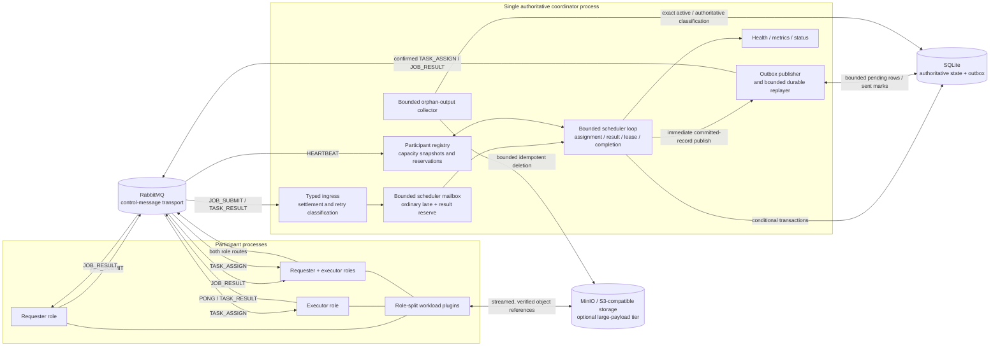
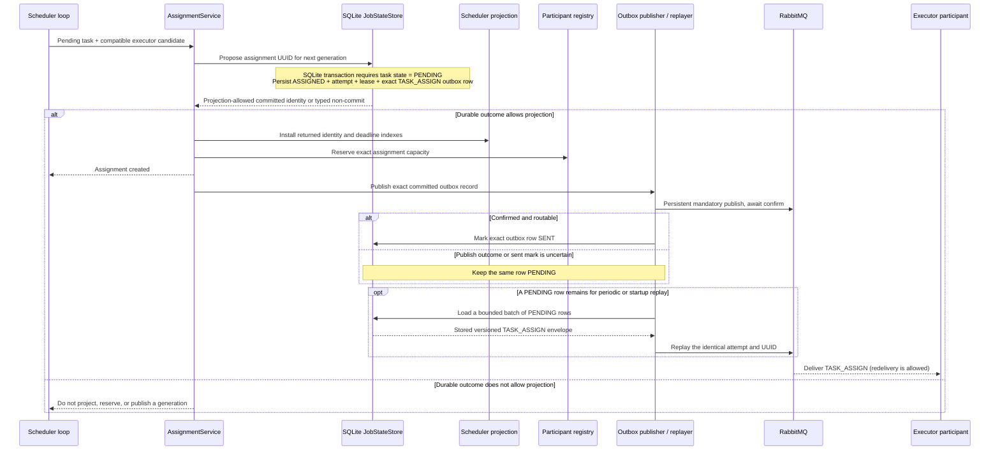
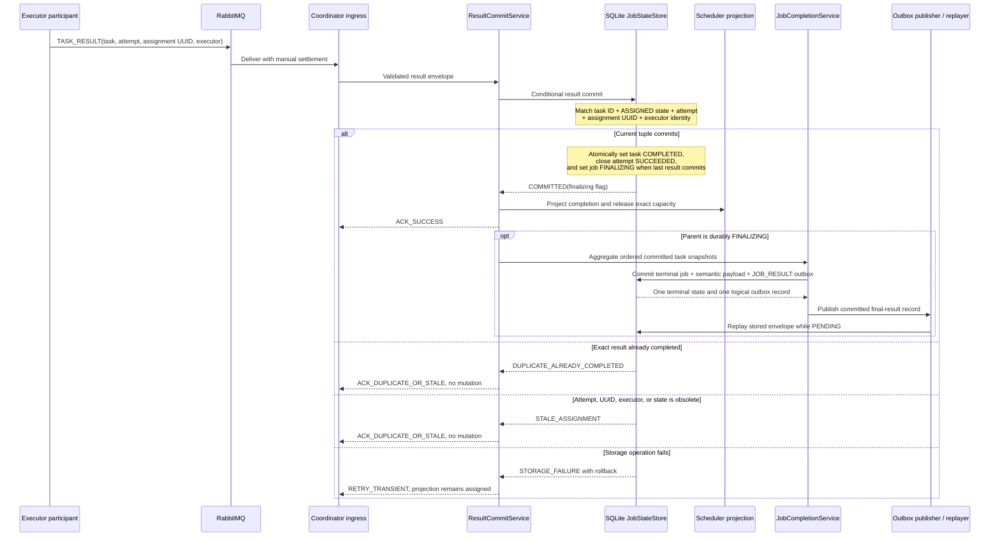
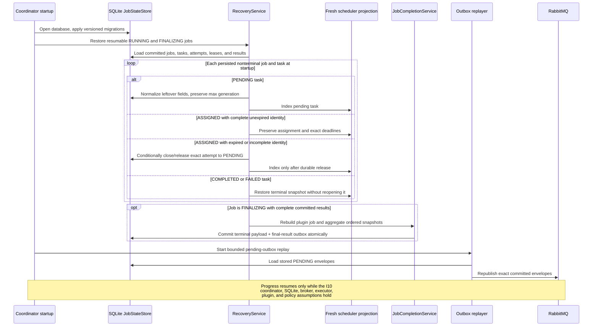
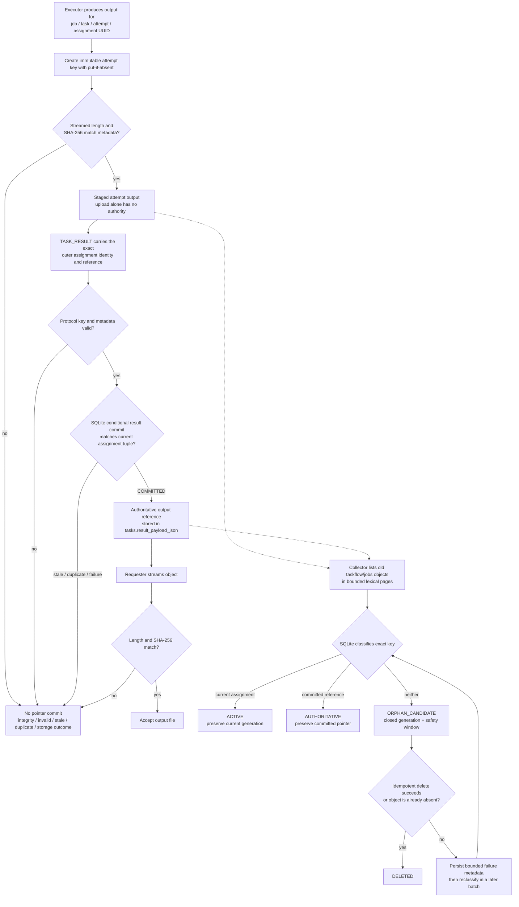
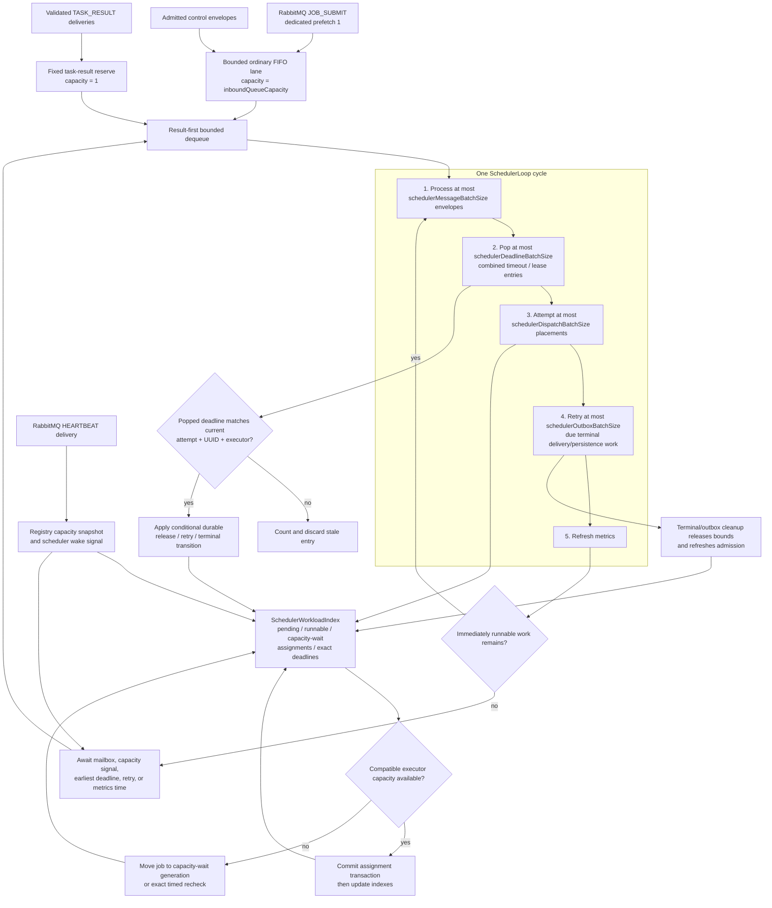

# Architecture Diagrams Tied to Invariants

These diagrams describe the implemented single-coordinator TaskFlow runtime on
`main`. They are views of the same current system, not alternative or planned
architectures. The invariant definitions are normative in
[Guarantees and non-goals](GUARANTEES.md), and the durable transition IDs are
defined in the [task and job state machine](STATE_MACHINE.md).

## 1. Component and context

**Protected invariants:** I1 durable acceptance; I2 single authoritative
result; I3 assignment fencing; I4 monotonic terminal state; I5 transactional
outbound intent; I6 duplicate tolerance; I7 bounded coordinator memory; I8
poison-message termination; I9 payload integrity; and I10 eventual terminality
under stated assumptions.

The coordinator is the only scheduling and result-commit authority.
Participant symmetry does not create shared authority; SQLite is the durable
source, RabbitMQ is the sole supported transport, and MinIO is a payload tier
rather than a state authority. Current boundary tests include
[RabbitMqOnlyRuntimeArchitectureTest](../taskflow-coordinator/src/test/java/server/RabbitMqOnlyRuntimeArchitectureTest.java),
[SchedulerArchitectureTest](../taskflow-core/src/test/java/server/scheduler/SchedulerArchitectureTest.java),
and
[ObjectStoreArchitectureTest](../taskflow-spi/src/test/java/objectstore/ObjectStoreArchitectureTest.java).

## 2. Assignment transaction and outbox sequence

**Protected invariants:** I3 assignment fencing, I5 transactional outbound
intent, and I6 duplicate tolerance.

The commit point is the SQLite transaction, not the scheduler proposal or
broker publish. Replay reuses the serialized identity returned by the
transaction and never advances the generation. See the T1 transition in the
[state machine](STATE_MACHINE.md),
[DatabaseManagerTest](../taskflow-persistence-sqlite/src/test/java/server/db/DatabaseManagerTest.java),
[RabbitMqOutboxReplayerTest](../taskflow-coordinator/src/test/java/server/rabbitmq/RabbitMqOutboxReplayerTest.java),
and the assignment failpoints in
[CrashWindowMatrixTest](../taskflow-coordinator/src/test/java/server/CrashWindowMatrixTest.java).

## 3. Result fencing and conditional commit sequence

**Protected invariants:** I2 single authoritative result, I3 assignment
fencing, I4 monotonic terminal state, I5 transactional outbound intent, and I6
duplicate tolerance.

Task commitment and terminal aggregation are deliberately separate durable
transactions. `FINALIZING` bridges their crash window, while the full
assignment tuple fences same-executor ABA results. Evidence is in
[AssignmentFencingIntegrationTest](../taskflow-coordinator/src/test/java/server/rabbitmq/AssignmentFencingIntegrationTest.java),
[TaskSchedulerPersistenceTest](../taskflow-core/src/test/java/server/scheduler/TaskSchedulerPersistenceTest.java),
[JobFinalizationCrashTest](../taskflow-coordinator/src/test/java/server/JobFinalizationCrashTest.java),
and
[RabbitMqCoordinatorLiveIntegrationTest](../taskflow-coordinator/src/test/java/server/rabbitmq/RabbitMqCoordinatorLiveIntegrationTest.java).

## 4. Coordinator restart and recovery sequence

**Protected invariants:** I1 durable acceptance, I3 assignment fencing, I4
monotonic terminal state, I5 transactional outbound intent, and I10 eventual
terminality under stated assumptions.

Recovery hydrates projections; it does not create another acceptance or reset a
generation. Unexpired assignments retain identity, expired assignments release
conditionally, terminal states stay terminal, and pending outbox rows replay
their stored envelope. See
[CoordinatorStartupRecoveryTest](../taskflow-coordinator/src/test/java/server/CoordinatorStartupRecoveryTest.java),
[PersistenceContractTest](../taskflow-core/src/test/java/server/db/PersistenceContractTest.java),
[JobFinalizationCrashTest](../taskflow-coordinator/src/test/java/server/JobFinalizationCrashTest.java),
and
[RabbitMqBrokerRecoveryIntegrationTest](../taskflow-coordinator/src/test/java/server/rabbitmq/RabbitMqBrokerRecoveryIntegrationTest.java).

## 5. Object-storage staged-output lifecycle

**Protected invariants:** I2 single authoritative result, I3 assignment
fencing, and I9 payload integrity.

The collector automatically considers only attempt outputs under
`taskflow/jobs/`; referenced inputs under `taskflow/inputs/` are outside its
deletion policy. Object creation time supplies the safety window, and every
retry reclassifies against SQLite before deletion. Current evidence includes
[ObjectStoreIntegrityContractTest](../taskflow-spi/src/test/java/objectstore/ObjectStoreIntegrityContractTest.java),
[MinioObjectStoreContractTest](../taskflow-objectstore-minio/src/test/java/objectstore/minio/MinioObjectStoreContractTest.java),
[OrphanOutputGcTest](../taskflow-coordinator/src/test/java/server/objectstore/OrphanOutputGcTest.java),
and the staged-output failpoints in
[CrashWindowMatrixTest](../taskflow-coordinator/src/test/java/server/CrashWindowMatrixTest.java).

## 6. Scheduler queues and deadline flow

**Protected invariants:** I4 monotonic terminal state, I7 bounded coordinator
memory, and I10 eventual terminality under stated assumptions.

Mailbox saturation never evicts accepted work: a result has one reserved slot,
both lanes remain bounded, every cycle reaches deadlines, and stale deadline
entries consume the same finite budget as current entries. Scheduler indexes
are post-commit projections rather than transition authority. Evidence is in
[SchedulerMailboxTest](../taskflow-core/src/test/java/server/scheduler/SchedulerMailboxTest.java),
[SchedulerLoopTest](../taskflow-core/src/test/java/server/scheduler/SchedulerLoopTest.java),
[SchedulerWorkloadIndexTest](../taskflow-core/src/test/java/server/scheduler/SchedulerWorkloadIndexTest.java),
[AssignmentServiceBatchTest](../taskflow-core/src/test/java/server/scheduler/AssignmentServiceBatchTest.java),
and
[SchedulerOverloadTest](../taskflow-core/src/test/java/server/scheduler/SchedulerOverloadTest.java).

## Scope boundary

These views intentionally stop at the current supported boundary: one
coordinator writer, one SQLite authority, RabbitMQ delivery, and optional
MinIO/S3-compatible payload storage. They do not depict active-active
coordinators, leader epochs, PostgreSQL, clustered broker failover,
Kubernetes, multi-region state, or automatic referenced-input deletion.
Those are not implemented Phase 8 architecture.
